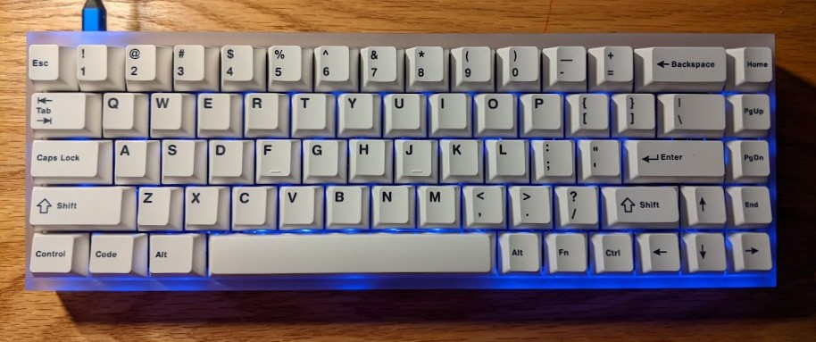

This is a manifesto for the modern blogger. It is a MANIFESTO in the sense that it [states and describes my ideas, views, and goals.](https://www.merriam-webster.com/dictionary/manifesto) It is also a somewhat of an ART MANIFESTO, where I outline what THE BLOGGER is, what they stand for, and how to be one. When i use THE BLOGGER as a proper noun, it refers to only the type of creator as outlined in this document. I do not overwrite any other definitions of a blogger. This is an opinion piece for what I see in my life and on the web.

There is no shortage of blog manifestos, in fact by 2012 it seems [every](http://jamesgstewart.com/blogging-manifesto/) [blog](https://www.socialmediatoday.com/content/manifesto-blogging) [had](https://chrisbrogan.com/stories/social-media/if-you-intend-to-blog-seriously/) [their](https://cbcmanifesto.blogspot.com/) [own](http://www.ocdqblog.com/home/the-mullet-blogging-manifesto.html). But I am here, a decade later, to try and list what is different. There has been a cementing of WEB 2.0, with the concentration of the interactive web onto the few major social media sites. I think this is helpful for some things (more people can easily share ideas) but detrimental for others (a platform serves advertisers, not users).

I'm mixing this manifesto with some other tech/hacker mindsets. The [1999 AnarchoHacker Manifesto](https://www.digitalmanifesto.net/manifestos/219/) or [Rosa Menkman's Glitch Studies Manifesto](http://amodern.net/wp-content/uploads/2016/05/2010_Original_Rosa-Menkman-Glitch-Studies-Manifesto.pdf) have some of these ideas, but there are others I've absorbed through the ether. These will be added to this post as i find them.

## The Blogger Exists

THE BLOGGER has three options. First, to blog publicly and openly as their OFFLINE IDENTITY. Second, to blog in a restricted sphere, but still as their OFFLINE IDENTITY. This results in a RESTRICTED IDENTITY. Third, to blog truly ANONYMOUSLY, as a PERSONA. The benefits of a well-put together blog can be felt for an OFFLINE IDENTITY, with an easy place to link friends, family, strangers, and employers. Consequences for harmful or contested content are greater the closer the blog is to the OFFLINE IDENTITY. Content can safely be more subversive when presented by a PERSONA.

THE BLOGGER must make this choice, and resist temptation to mix these spheres.

## The Blogger Posts

THE BLOGGER must make public posts on the internet. It is recommended there be a regular schedule. There doesn't have to be. A common trend among content creators is the struggle to determine if something is 'good enough' for public view. Published is better than perfect. Strike when the iron is hot. Now is better than when the topic doesn't matter anymore. 

## The Blogger is Authentic

THE BLOGGER has no responsibility for truth (it is simply recommended, and desired by readers), but misrepresenting a community, emotion, or experience is untenable. THE BLOGGER should mind the line between opinion and truth, using sources when appropriate.

## The Blogger 

## The Blogger is Nomadic

Hosting sites rise and fall, and sites implement changes or censorship at short notice. Technologies that support blogging can fall into disrepair in a matter of years. THE BLOGGER must have no attachment to a particular hosting site or method. Content should be backed up locally, and THE BLOGGER must be ready to restructure should the need arise.

Not only is the primary content vulnerable, but supporting content can be destroyed by LINK ROT. THE BLOGGER minds the ephemerable nature of web content and saves all things necessary to them. Remote content that is critical to the message of a post should be SAVED. Remote content that adds value but is not necessary should be CLEAR in what it contains.

## The Blogger 

Brevity

responsive to critique

## The Blogger isnt:

Tumblrina: 

Influencer:

Reposter:

relevant? is the blogger relevant?

If I'm wrong? Tell me. 

## Other Readings

[Slow Blog Manifesto, by Todd Sieling](https://www.digitalmanifesto.net/manifestos/11/)

This is a short piece that 

