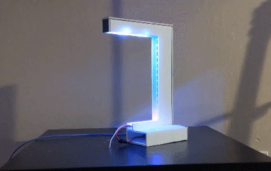

A fun decorative light that reacts when a downlink or uplink travels over the Deep Space Network. [View project on GitHub.](https://github.com/starmaid/pulseofexploration)

## Timeline

**Pre-2018**

- I saw the [ISS-Above project](http://www.issabove.com/), and it had an effect on me.

**July 2019**

- Was talking about the [Deep Space Network](https://en.wikipedia.org/wiki/NASA_Deep_Space_Network) and the [Pulse of Exploration](https://vimeo.com/93420747) with my friends on the Mars Helicopter team who went down to JPL.
- While talking to different friend about visualizing data in cool and fun ways. Reminded of DSN.
- Found a project blog post about polling DSN Now. (Can't find it anymore).

**Oct 2020**

- Remember these ideas while reading the sequel to [17776](https://www.sbnation.com/a/17776-football), [20020](https://www.sbnation.com/c/secret-base/21410129/20020).
- [Make a Discord bot to use in the server, DSNBot](https://github.com/starmaid/dsnbot). This bot polls from DSN on command from a user.

I continually updated DSNBot until mid 2021, adding new features and using it as a testing ground.

**August 2021**

- The [discord.py fiasco](https://gist.github.com/Rapptz/4a2f62751b9600a31a0d3c78100287f1) happens.

**October 2021**

- (I find out about discord.py) 
- I realize I cant have all my work dependent on a single framework.
- Remember the desire to make my own verison of the Pulse of Exploration.

## Design

I got the idea of using a single LED strip instead of a much more complex setp - this would be the core of the project, keeping everything simple and easily replicable.

### Requirements

- Conveys information from DSN
- Looks interesting
- Easy to build (no soldering?)
- Adaptable for many setups
- Extensible in the future for other uses

### Build

I saw a good opportunity to refresh my knowledge of multithreading in Python, and it was basically textbook. Three threads (Lights, SequenceManager, and DSN) passing data around with an asynchronus queue.

My original plan was to use DSN polling code from DSNBot, but I had structured it in a method that didn't get me the data I wanted. I ended up rewriting most of it.

I knew I wanted to play custom animations on the sky section, but was not sure how I would store them. Until now, I control all my lights with sine curves and raw RGB values. I had a breakthrough about how to store a set of 1D frames efficiently, and how to edit them quickly. The idea of 2D images felt amazing to think of, even if its not original. I havent researched it or anything. A second idea came when I realized the animations could be, in 2D, pixel art of the planets they represent.

As for physical setup, I was thinking about 3D printing something. But I got lazy and tired, and just made it out of Dollar Tree Redi-Board.

## Collaborate

### Themes


The themes are more than just playing the pictures, see this key line in the `main.py`:

```
try:
    # Attempt to load the class from lights.py
    classname = getattr(lights,locname)
    newSequence = classname(self.lights, self.sky, ship=q.activeSignals[s])
    logging.debug('Found LightSequence class ', classname)
except AttributeError:
    # If that that class doesnt exist, load that image
    logging.debug('LightSequence Class not found. Loading image file')
    newSequence = lights.Img(self.lights, self.sky, 
            self.themeName,locname,ship=q.activeSignals[s])
```

A dev can extend the *LightSequence* class and a user can set a ship to trigger it in `theme.json` for programatically custom lights. I have moved most helpful functions in there so anyone has access.

the transmission and ground are a little less intentionally flexible, but thats because they do slightly more complex things. Sorry :/

## Future

I kind of want to put this project to rest. the DSN brainrot has lasted for almost two years, I want to move on. However, I would love for this project to get a little size and see what people do with it. I'll do whatever work is required to make it easy and fun for other people to build their own. 

Im mad about the RPI shortage. 10x prices, and raiesd prices for the forseeable future. [This will affect the project completion rate I think.](https://img.ifunny.co/images/3cda13b1552639d8ec84701bdcb205179f6a4b143e1907bdf1fac2fbf843eac4_1.webp)

