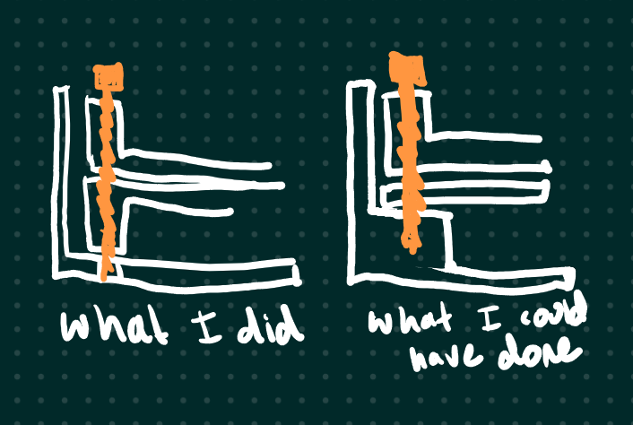

[picture of final setup]

This project was a group effort with [George Hosono](link).

## Idea

The original concept was to make a system that would monitor one or more plants around Briar's house. George and I went back and forth on using a central server with a bunch of distributed raspberry pi devices, but the simplicity of one RPI Zero W with all the sensors we could pack on it sounded like a simpler and more elegant solution.

## Hardware

- Raspberry Pi Zero W
- ADC
- Soil Moisture Sensor
- Ambient Light Sensor
- Thermometer
- Display

These together should give enough information to know if the plant is struggling. The display also allows a personal touch and some interesting thing to look at instead of a black box that requires opening a webpage on your phone.

After settling on the hardware, I made a few sketches to determine the shape, and made some initial CAD. I used FreeCAD again here, learning more about the Part Design workflow. I also used multiple bodies in one part for the first time. I don't know if this is the intended assembly workflow, but it was satisfactory for my pusposes. There are a few quirks when using booleans, but I was able to work around them.

[image of first freecad assembly]

I also made some Blender renders for fun. I feel like this looks a little like a product advertisement on Kickstarter.

[another blender render]

I then started routing the wires in Fritzing. This would simplify my eventual process of wiring the real thing and prevent mistakes.

[fritzing]

As I was designing this, the biggest limiting factor was my `30 mm` screws that were going to hold everything together. This was the longest M3 or M4 bolt I could find, and as I write this post I realize a way I could have saved another `10 mm`. 

I also just didn't want to make the enclosure too large. I initially thought the design would be rather thin and narrow, but the Raspberry Pi has headers on it, and the wires in the lower section took up more space than i anticipated.

As a finishing touch, I used clear nail polish as a conformal coat. This would hopefully protect the various electronics from splashes and the moisture. I found a bunch of people arguing about this topic on the internet - if you have an ACTUAL REASON why nail polish is bad for PCB's, let me know.

## Software

I remembered a program I found in 2021 - [Mycodo](https://github.com/kizniche/Mycodo). At the time I was researching hydroponics for my university senior project. I managed to find the [youtube video](https://www.youtube.com/watch?v=nyqykZK2Ev4) in my history, and found Kyle's github from there. Shoutout to the breakcore at 4:42.



Mycodo is a web-based interface for managing plants. Every single input and output has already been implemented, and others can be easily written in Python and shared with the community. The exact model ADC and display were already implemented, so we didn't even need to look up the default i2c address.

[screenshot of ui]

I plugged in one of my Raspberry Pi 3B+'s to the daughter board and loaded the software. I ran the `curl | bash` script (which was in style at the time) and configured the sensors to monitor the voltage. I then set up the screen, plugged in a webcam, and gave George a login to my network via VPN. This way he could work on configuring the software.

[webcam image]

I think this is the most hilarious kind of remote work. I recieved an interesting message while he was configuring the thermometor.

[temperature text]

As it was around time in the afternoon in late july, and my apartment didn't have air conditioning. I placed a thermometer next to the webcam.

## Finished Product

I handed the box off to George before he went back down to San Diego. I also created a backup of the Mycodo config to send. 

[picture in a plant]

[final picture]

This project was a fun group effort and a reason to learn more about freecad. The amount of programming was almost zero, which was ultimately kind of disappointing. I feel like George didn't have a lot to do after calibrating the sensors. But that's life, and projects have many different ways of shaking out.