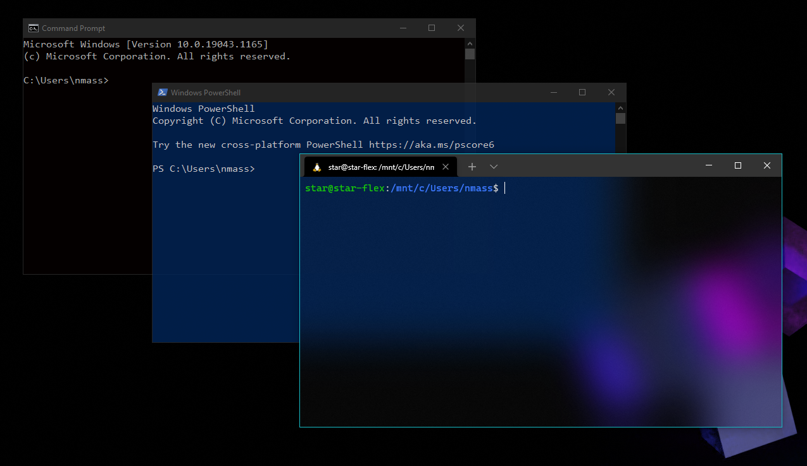
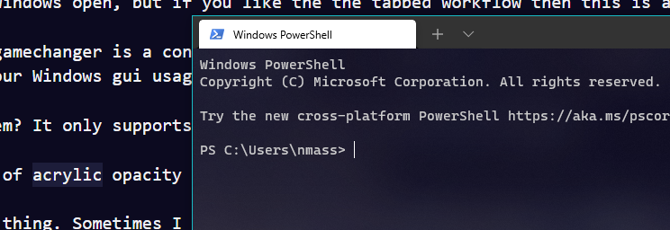
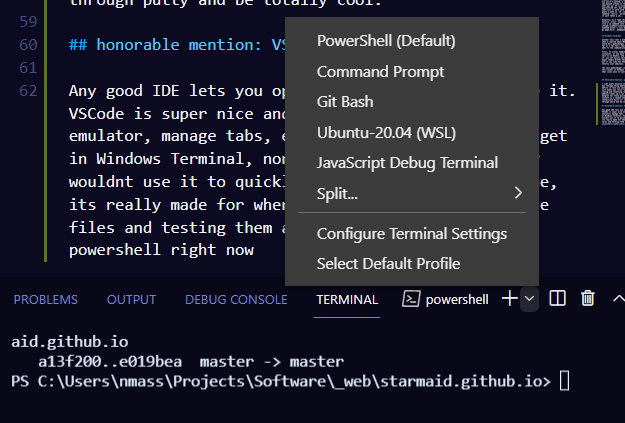

This post will be a formalized set of musings I have had over the past several years about various command line utilities in the Windows 10 operating system. I could make an entirely separate post detailing why I am using Windows in the first place, but this is simply not the time. Everyone has reasons to use one OS over another, and this conversation of terminals happens after that descision is made.

The Unix shell, and the various terminals that can be used to access it, is the purest, rawest interaction a human can have easily with a computer. You could [bitbash a TTY connection over serial from an arduino](https://www.youtube.com/watch?v=2XLZ4Z8LpEE), or [write machine code onto a ROM chip](https://www.youtube.com/watch?v=LnzuMJLZRdU) with a 555 timer and two buttons, but I'm talking about real things. You can [open up a TTY session on any linux machine with ctrl+alt+FX](https://www.howtogeek.com/428174/what-is-a-tty-on-linux-and-how-to-use-the-tty-command/) if you dont want to mess with any emulators. But realistically, we want some form of terminal emulation that gives us some extra tools, some visual customization, and usability that ensures real productivity.

There are also [many third-party terminal emulators for Windows](https://www.slant.co/topics/1552/~best-terminal-emulators-for-windows) that people love to argue about as much as people on the internet like to argue about anything. I'm just going to focus on the built-in emulators that will be on any computer you sit down at. 

## Windows Command Prompt

Developed by Therese Stowell in 1987, `cmd.exe` was developed to replace DOS's `command.com` for the Windows NT family. There are 45 built-in commands, as essential to the windows experience as any. The Command Prompt that we use today emulates these DOS commands and talks directly to system procesees.

*"we aren't in unix anymore, toto"*

The biggest upside of using the Command Prompt is just the classic feel, and the closeness it feels to the Windows core. As all those "ls is not recognized" memes go, it really is unapolagetically itself. You have all your `$PATH` variables just as you expect them, which is great when installing your Python versions or other programs.

However, its not the best. There is no easy way to navigate to a folder in File Explorer and open it in Command Prompt, which is something I want to do fairly frequently. Also, there is no `tab` completion - not even for filenames. There are also some advanced windows features that are not accessible through the plain command prompt, so I moved onto the next built-in solution...

## Windows Powershell

This is Microsoft's current pet project for interfacing with a Windows computer. More powerful, more commands, and some nice ease-of-use changes make this shell feel more modern. It interfaces with the .NET core on Windows. It is baked right into Windows explorer, and opening a folder with Powershell is right in the `file` menu. 

Tab completion makes a nice arrival, and so does some extra tools like task scheduling (not quite as easy as cron, but still useful). The scripting language is also slightly different, and I think a bit more pleasant than batch. Of course, good luck sharing them with anyone, as the hoops to run external `.ps` files are pretty extensive - and I don't blame em, because really who is trying to run a powershell script. I would block them too.

Basically, If you are going to be writing your own Windows user management automation stuff, or aren't allowed to get WSL up and running, theres no real issues with Powershell. It does what it was made to do.

## WSL terminals

I didn't learn about WSL until mid-2020, which was way after it had left beta and was already in all win10 boxes. I was so suprised that I rushed and installed it as soon as I could, and was so sure it was going to be a game changer!

In a way, it totally is. I installed Ubuntu 20.04, the classic verison, and was amazed I could run whatever CLI utils I wanted. I could `neofetch` my windows box, and messed around in those virtual directories to see what was up. It is nice that the area is sort of quarantined off, but when it came time to actually do some sort of work with it, you can't just copy and paste a path to `cd` into. You have to modify the leading `/mnt/c:` instead of just `C:` which like, idk it just takes a sec. 

Honestly, as I type this I'm realizing that I could totally `alias` something in there, a quick script to turn a cd command into something that dynamically changes windows-internal paths to be in the apropriate mounted drive. I will do that and perhaps release it on my page here...hmmmmmmm...

## Windows Terminal

Another tool that I didnt find out about until around when I learned about WSL is Windows Terminal. This one isn't connecting to a different command set like the first three are, it's an emulator that does tabbing and theme management for the terminals you have already. I was initially thinking this would be a gamechanger - and maybe it still will be. As far as I can tell, there are two main things that this adds to the commandline experience on Windows:

First, it allows tabbing of various other terminal instances. If you want to quickly open a powershell next to an Ubuntu, and then add a tab of Kali next to it, you can easily switch between the three of them. I might simply prefer having three separate windows open, but if you like the the tabbed workflow then this is a totally cool addition. 

The next gamechanger is a contextmenu entry for "open this folder in Windows Terminal", which really brings that linux ease to your Windows gui usage patterns.

Big problem? It only supports Acrylic Opacity. And heres the thing. Sometimes I want to read something thats behind my terminal! That's why I enable translucency on all my terminals. I do, also, enjoy the gaussian blur, but its too much for my tastes here. See what the terminal looks like on 100% acrylic. 

This is an [open issue in Windows Terminal's development](https://github.com/microsoft/terminal/issues/1753), but I don't see it getting resolved anytime soon. The nerds in the comments have been sated by a clean AutoHotKey script that does exactly what they want, and I might try it out. Sure I have AHK installed, but I'm evaluating the STOCK terminal applications here without any hacks. Installing another program and having to run it at the same time isn't just a matter of dotfiles, its severely out of the way for functioning as desired.

## honorable mention: VSCode Terminal

Any good IDE lets you open a terminal window inside it. VSCode is super nice and lets you set your default emulator, manage tabs, etc. All the cool stuff you get in Windows Terminal, none of the hassle. I probably wouldnt use it to quickly work with a remote machine, its really made for when you are working with source files and testing them as you go. I have the default set to PowerShell right now, as I mentioned it has all the ease of use I really need right now.

## honorable mention: KiTTY

I was going to have an honorable mention for PuTTY, but while doing some of my research I found that [KiTTY](https://github.com/cyd01/KiTTY/) already has improved PuTTY for years. They are both your classic TTY consoles where you can connect to another computer over a network or cable. It handles sessions and keys better than Powershell does, and of course takes the nonsense out of non-SSH connections that you might have to do otherwise.

### Conclusions

Anyway, theres a bunch of different ways to interface with your machine. They all have different benefits, and theres different ways to manage sessions, different appearances, different workflows, etc. I have been using Powershell a lot, mostly because I hit the "Open this folder in PowerShell" context menu. I use WSL if I want to run a program that is made for Linux, or use grep something that I don't immediately know how to do in PS because its not worth learning. I'll use these in their bespoke consoles if its a one-off task, or I'll do them in the VSCode terminal if its related to something I'm writing. Maybe I'll open something in Windows Terminal if I'm trying to impress someone with that acrylic effect on an empty desktop background. Its all dependent on the scenario.

Let me know what you think.
