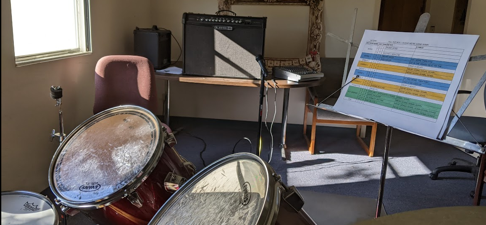
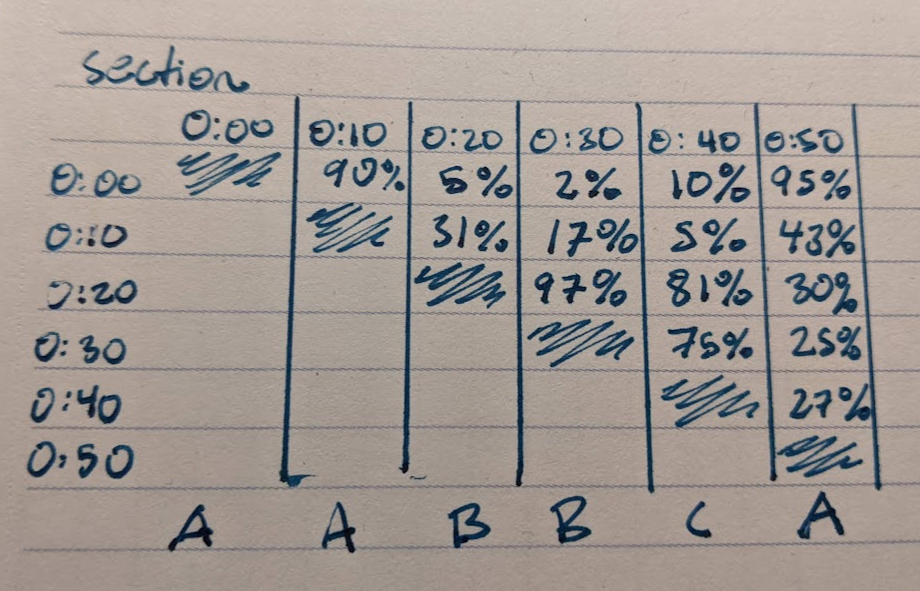
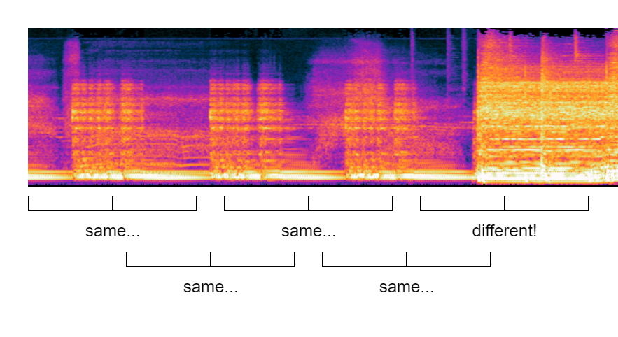
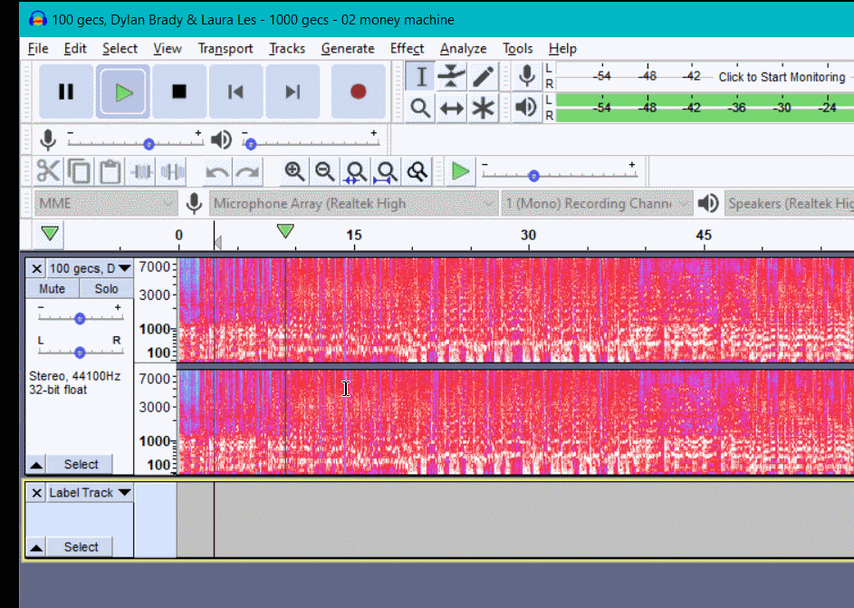
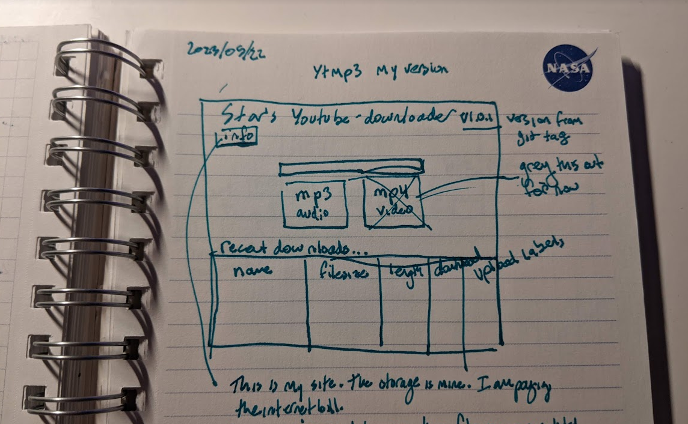
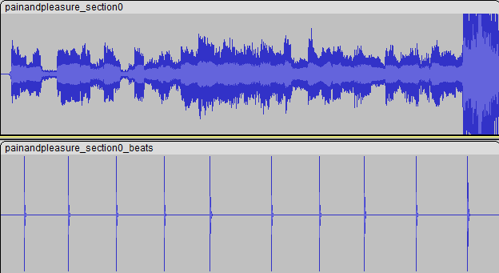
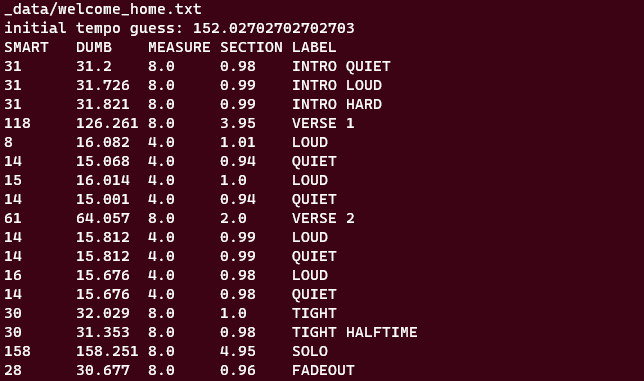

*Written June 2023*

I wanted to learn a little bit about AI, and hopefully make my sightreading a little bit faster.

[project on github](https://github.com/starmaid/songstructure)

## Preface: what are Song Structure Sheets?

I like making these sheets. Started when playing with parents and bianco because we had to learn a lot of songs fast. good for playing along, and also good for remembering lyrics when you already mostly know how they go.

They have solidified into this format. I am pretty satisfied and know all i need to know on drums. 

Maybe more chord information would be useful when playing gutiar, especially if I still don't know the song. This is when my listens are still relatively low.

Generating them is relatively time-intensive, especially if I have never heard the song again. Lots of counting on fingers.

## Idea

I have miraculously avoided any machine learning so far, and I finally wanted to change that. Finding some task that needs pattern recognition is the simplest candidate. Creating these song charts seems well-bounded, and deterministic based on patterns that are easily human-recognizable. This seemed like a good option to get started.

## Prior Art

The most popular and obvious effort in this space is Pychorus ([article](https://towardsdatascience.com/finding-choruses-in-songs-with-python-a925165f94a8) and [github](https://github.com/vivjay30/pychorus)). This is an analytical solution to detecting which part of the song is the chorus, by finding note-time similarity binned by tempo. This is a fast and simple solution that works on steady electronic sounds, but the author states hwo chanigng tempos introduce error (one being worked on) and that an AI model would do much better.

*The time-lag similarity matrix from pychorus - horizontal black lines represent similarity.*

## Learning

I first looked at what tools are availible. I wanted to use my own hardware (I paid good money for this GPU) and I wanted to use Python, so looked like pytorch, tensorflow, and scikit-learn were the three most promising options. I picked tensorflow, as they had a set of good audio handling wrappers.

I took their [intro course](https://developers.google.com/machine-learning/crash-course/ml-intro) and got down the basics of linear models, the terminology, and other stuff. I came up with a few methods I was considering using:

### Clustering by Section

Split the song into overlapping 1-2 second audio clips. *Cluster* them by similarity. Use the similar times to generate A, B, C, etc sections. If reliable enough, possibly *Classify* those parts as CHORUS or VERSE etc. This approach is most similar to the model in pychorus, but leverages the power of AI to do clustering, not relying on exact patterns to match. 

**Problem**: Would training a model would have to be done on EACH SONG? How would this work accross genres?

### Split by Difference

Split the song into non-overlapping 1-2 second audio clips, staggered at many start times. For two clips, determine how 'far apart' those clips are, determining if a transition happened.

**Problem**: Silent measures? Chords held for more than 1 second? All except the simplest music is too complex for this.

### Find Visual Changes

Feed the whole song in as a spectrogram image. Detect vertical lines where the song changes section based only on this. 

**Problem**: Metal and rock spectrograms have almost no perceptible changes between sections.

## Getting Started

I knew whatever happened I would need training data - songs labeled into sections. I spent some time thinking up ways to do this in react or tkinter, but found out that [Audacity]() has a built-in labeling system - way better than I could ever make. This generates some nice text files to parse.

I also was thinking of ways to ~~con my friends~~ *leverage the open-source community* for helping create these labeled tracks. If audacity is easy enough and everyone has it installed, I would just need a way to let them upload mp3's and txt's. I started planning a server and possibly providing a frontend for my own youtube-mp3 service. 

However, I decided to keep things quiet and focus on the meat of the problem before spending hours making a data collection service.

## An Analytic Solution

I wanted to finish the pipeline from song to sheet, so I started working on the parts after the individual sections of the song are identified. This includes determining tempo, and writing out the length and number of repeats of the other sections.

This could be done with librosa and beat detection. Some simple math sorts repeats out by likelihood, but isn't perfect. The beat detection is also not perfect, but it is simple enough.

*Money machine by 100 gecs works pretty well!*

*The intro to Pain and Pleasure by Judas Priest does not work...*

This, combined with manually labeling the tracks in Audacity, is the minimum we can do to make a useful track chart. This leaves the user with the only need to add lyrics and notes, and then touch up the formatting and colors.

## Descision on AI

With the manual solution, I made two charts for songs, and it was pretty quick and easy. Then I realized i was bored, and stopped. AI would be minimally effective, and hard to train. I will have to keep looking for a good project to apply AI to.
