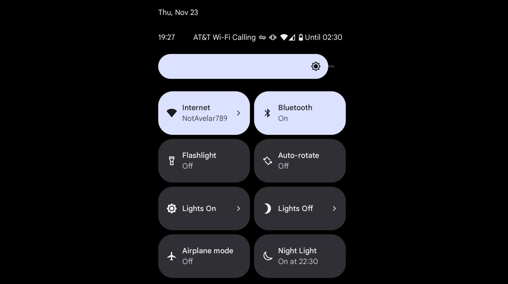
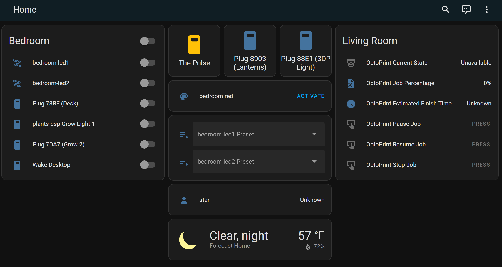

I have some LED strips in my room. Usually I turn them on and off by unplugging the usb cables. I have some grow lights. I dremeled into one of them and installed a relay, which I controlled with an ESP32 that asked ntp what time it was. I turned on and off my computer monitors by flipping a switch on a power strip. Life was simple. I thought Phillips Hue was gimmicky.

Then recently I decided to rework how I controlled my light strips. I accidentally shorted one of my arduinos because it was just hanging out in the open and the pins bumped into the aluminum rail, so I was making a nicer board and enclosure. While doing this, I thought it would be cool to add features, so I was googling better software for controlling them. I found [WLED](https://github.com/Aircoookie/WLED). I saw it had 'Home Assistant integration'. Huh, wonder what that is. Don't care.

I then decided I wanted to turn off the grow light in my room at will, maybe with some packet from my phone. I knew about WLED, so I figured someone had written good software for that. I found something called [ESPHome](https://esphome.io/). Woah, its built to work with something called Home Assistant. Funny I saw that same logo just a few days ago.

I was scrolling on youtube, and saw [Zach Freedman's new video about home automation, which talked about how easy it is to set up Home Assistant and get everything in your house connected to it](https://www.youtube.com/watch?v=8y2LjkndbCM). 



## Alright, Fine.

An angry god was giving me visions of home automation. [So I followed their guide to get started with a RPI3](https://www.home-assistant.io/). There are a million tutorials on this. I set up ESPHOME on my grow lights. It was incredibly simple. I set up WLED on more ESP32's for my strip lights. Everything was done in a browser and a GUI. It even detected OctoPrint running on my network! One click and my 3D printer information was on the dashboard. It felt too easy, but there it was! I even installed the android app, and the lightswitch is right there in my system tray. 



I then thought how easy it would be to control a few outlets, which would let me control the other grow lights without dremeling into them! And a few more lights, and the hard-to-reach switch of my desk's new location. I bought some TP-Link Kasa smart outlets. When installing them, Home Assistant offers a Python command-line tool that goes around any need to install an app or create an account! Provisioned them quickly, and now I have 4 more smart objects.


## Falling into the Hole

A few days later I sat down to watch Blade Runner (1982). I very smugly sat down, and then used my phone to turn off the lights. However, the dim flashing lights of my [The Pulse](https://github.com/starmaid/pulseofexploration) were suddenly distracting. I needed to turn it off too. However, This requires SSH-ing in and powering off the RPI driving it. That takes a minute, so sometimes I just unplug it...don't tell anyone. But I've seen SD cards get corrupted, so lets just add a feature.

*I told myself I would never touch that code again...*

```python
async def handle_client(self,reader,writer):
    global lights_on_override
    message = await reader.read(1024)
    logging.debug(f'tcp rcv: {message}')
    m = message.decode().strip().upper()

    if m == 'ON':
        logging.debug("tcp command: ON")
        lights_on_override = True
        writer.write(b'OK')
    elif m == 'OFF':
        logging.debug("tcp command: OFF")
        lights_on_override = False
        writer.write(b'OK')
    elif m == 'STATUS':
        if lights_on_override:
            writer.write(b'ON')
        else:
            writer.write(b'OFF')
    else:
        logging.debug(f"tcp command: bad")
        writer.write(b'BAD CMD')
```

Okay that was easy. I had to dig through the `asyncio` library for their TCP server code but I figured it out. Now we can toss a few lines in the `configuration.yaml` file:

```yaml

command_line:
  - switch:
        name: The Pulse
        unique_id: pulse_of_exploration 
        command_on: 'echo "ON" | nc dsn.local 9996'
        command_off: 'echo "OFF" | nc dsn.local 9996'
        command_state: 'echo "STATUS" | nc dsn.local 9996'
        value_template: '{{ value == "ON" }}'

```


## One more thing

I frequently want to remote into my desktop from my laptops. To do this while away from home, I enable my VPN, SSH into one of my raspberry pis, and then hit the up arrow until my last `wakeonlan` command (with the MAC of my desktop saved) shows up in my bash history. Turns out Home Assistant has a wake on lan feature.

```yaml
wake_on_lan:
# The wake_on_lan integration does not support any configuration parameters

switch:
    platform: wake_on_lan
    name: "Wake Desktop"
    mac: "XX:XX:XX:XX:XX:XX"
    host: 192.168.0.257
```

For now, this is all. Screenshot of the dashboard:



Lets hope it stops here.