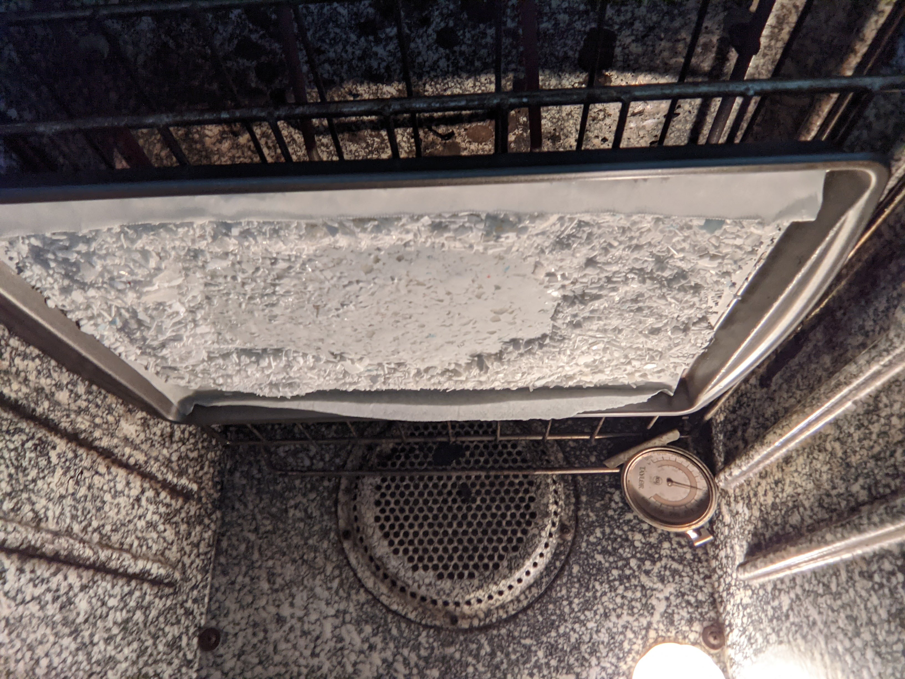

Here's a list of some fun things I made in 2021 that aren't worth a full post.

Slapped some LEDs and a switch on a PSU to use as a desktop supply for 5V and 12V projects.

Made a red light therapy mask for my mother.

Grew some plants, and connected a discord bot to a camera feed.

Desk setup at college.

Touched up my discord CLI app. Nice for running on a raspberry pi.

I like this store.

4 monitor setup. Lots of adapters.

Ground up and recycled some PLA from 3D printing into a sheet in the oven. Smelled bad.

Carved a pumpkin :)

