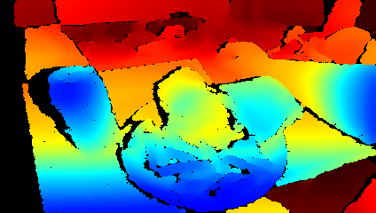
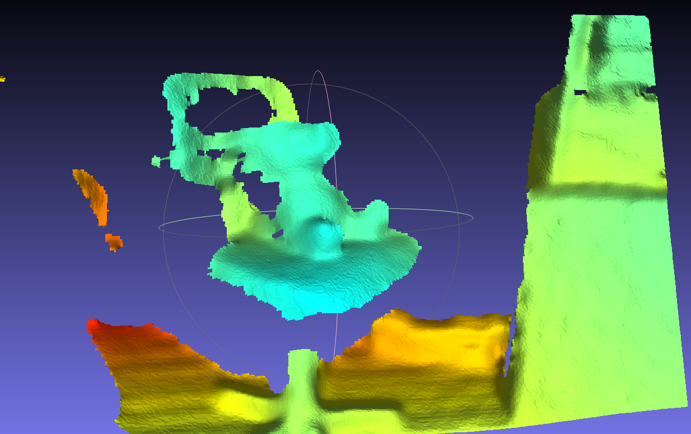
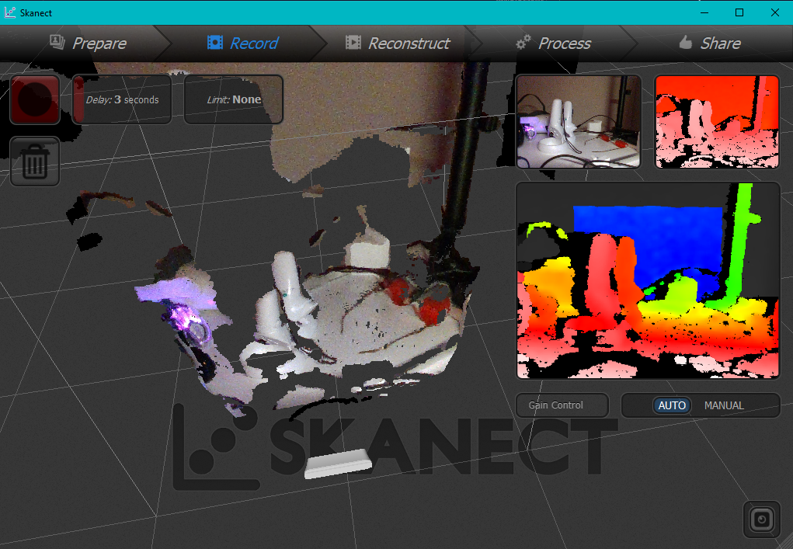

Written November 2023

## Introduction

Previously, [I had pretty rotten luck with a hacked stereo camera](/projects/ps4-stereo-camera/). My frustration caused me to search for a hardware alternative, which I found as the Intel D435. It seemed like a pretty solid platform, had a well-supported API, did processing on the hardware, and a lively developer community. I grabbed a used one off amazon for $160. This post will document how I got it working for the various things I want to do with it.

*Aside - the first package was stolen off my apartment's mailbox. That was annoying, but the seller replaced it at no charge. I later found the original opened box in the locked recycling area for my building >_>. A thief is afoot!*


## Get Started

Dead simple. [Intel has a Get Started page.](https://www.intelrealsense.com/get-started-depth-camera/)

- [Install on Windows](https://github.com/IntelRealSense/librealsense/releases/latest)
    
    Remember, you can either just download the viewer exe, or more likely you will want to download the SDK install exe. This will install the viewer, as well as C++ and Python library bindings.
- [Install on Linux](https://github.com/IntelRealSense/librealsense/blob/development/doc/distribution_linux.md)
- [Install on RPI](https://github.com/IntelRealSense/librealsense/blob/development/doc/installation_raspbian.md)

With the RealSense Viewer installed, you can take color/depth photos, which can be saved as images or as point clouds. These can be opened with a tool like [MeshLab](https://www.meshlab.net/) to do cool things.





The recorded video files are ROS `.bag` files that can be played back in [rviz](https://wiki.ros.org/rviz), or if you dont want to install all that, just drag and drop the file into [webviz](https://webviz.io/app).


## 3D Scanning

One of the first applications that someone with a depth camera wants to do is scan stuff. You don't have to write any code, people already did that! I was looking for open source, or at least free applications that would let me take bad scans that I can manually clean up. I don't need dimensional accuracy - sometimes I just want to get something into the computer!

### Getting a program

- [Skanect](https://structure.io/skanect) is probably the most historically rich free scanning solutions. Relies on OpenNI2. Closed source. Also, doesn't support Nvidia 30-series GPUs or newer for Cuda. That's ok, your CPU is fast enough nowadays anyway. 
- [RecFusion](https://www.recfusion.net/) has RealSense API support. Closed source, you have to pay for more than 50k tris.
- [ReconstructMe](https://www.reconstructme.net/) is free for non-commercial use. Relies on OpenNI2. Closed source.
- [Open3D](http://www.open3d.org/docs/latest/tutorial/t_reconstruction_system/index.html) has a depth reconstruction example built-in. This has RealSense API support.

### Compile RealSense Drivers with OpenNI2 Support

When I was testing the programs that relied on OpenNI2, I learned that Intel does not include the wrapper by default. But, [Intel has a page for that!](https://github.com/IntelRealSense/librealsense/tree/master/wrappers/openni2#getting-started) Basic steps:

- Download [OpenNI2 SDK](https://structure.io/openni)

- Download [RealSense2 SDK](https://github.com/IntelRealSense/librealsense/releases)

- Run CMake on RealSense driver and configure environment variables for the SDK:
    * `OPENNI2_DIR` should be the root install directory of OpenNI2. (For linux, the path may be "/usr/include/openni2")

- Generate project files and compile Release drivers

- For Windows, copy `build/_out/Release/rs2driver.dll` and `build/Release/realsense2.dll` to `OPENNI2_DIR/Samples/Bin/OpenNI2/Drivers/`

    *Also, you will have to copy these files to every program's OpenNI2 folder. For example:*

    `C:\Program Files\Skanect 1.11\bin\OpenNI2\Drivers`

    `C:\Program Files\ReconstructMe\bin\OpenNI2\Drivers`

- For Linux, copy librs2driver.so and librealsense2.so to OPENNI2_DIR/Samples/Bin/OpenNI2/Drivers/

I followed those steps, but the OpenNI2 programs were still not detecting the camera. 

### Intel OpenNI2 Wrapper Bugs

I opened the logs, and found some errors. Here is the one from Skanect:

```
INFO: OpenNI2: Device "043422070239" present.
INFO: OpenNI2: Device info: [PS1080] [7463] [1537].
INFO: OpenNI2: Number of devices: 1
INFO: No support for softkinetic, skipping.
INFO: OpenNI2: Opening: 043422070239
INFO: OpenNI2: Number of devices: 1
WARNING: Could not switch to VGA depth mode.
ERROR: OpenNI2: Couldn't prepare depth stream: 	Stream setProperty(7) failed
```

SetProperty(7) allows setting stream mirroring on/off. If they got the `ONI_STATUS_NOT_SUPPORTED` response, Skanect and ReconstructMe just crash. That's stupid. But one of these two things is open source, and its not the scanning application.


[I reported this on the librealsense GitHub page](https://github.com/IntelRealSense/librealsense/issues/12363). Within a few hours they had responded to me! Turns out they don't ACTUALLY care about the OpenNI wrapper, and haven't updated it in a long time. Guess this is in my hands now. Lets see if i can do the dumbest, bare minimum fix - if this doesn't work, I'll just give up and do something else.

I changed two things in the file `librealsense\wrappers\openni2\src\Rs2StreamProps.cpp` :

- Inside `isPropertySupported()` moved `ONI_STREAM_PROPERTY_MIRRORING` to the section of unsupported things (why did they have it returning true before???).

    ```
    case ONI_STREAM_PROPERTY_MIRRORING:
		return false;
    ```

    NIViewer (the viewer that ships with the SDK) is the only program I think that actually respects this. This doesn't do anything for the 3D scanning programs, they still crash. However, I can't handle just leaving it as reporting supported.

- Inside `setProperty()` made it so trying to mirror doesn't do anything, but returns `ONI_STATUS_OK`

    ```
    case ONI_STREAM_PROPERTY_MIRRORING:
	{
		return ONI_STATUS_OK;
		break;
	}
    ```

With these fixes, Skanect and ReconstructMe function just fine. They were probably just turning OFF mirroring as part of initialization. Yay for stupid fixes! 



```
INFO: OpenNI2: Device "043422070239" present.
INFO: OpenNI2: Device info: [PS1080] [7463] [1537].
INFO: OpenNI2: Number of devices: 1
INFO: No support for softkinetic, skipping.
INFO: OpenNI2: Opening: 043422070239
INFO: OpenNI2: Number of devices: 1
WARNING: Could not switch to VGA depth mode.
INFO: Depth Intrinsics: fx/fy/cx/cy [384.152 | 384.152 | 320.000 | 240.000]
INFO: Color Intrinsics: fx/fy/cx/cy [384.152 | 384.152 | 320.000 | 240.000]
WARNING: Could not read device serial number.
INFO: OpenNI2 Status: 
```

If you want to just download my dlls, [go to the fork on my github.](https://github.com/starmaid/librealsense)

I will update this page if/when my PR is accepted into the main branch.

### Actually Scanning Stuff

Each of these programs give varying results.


### Python Bindings

Ok, so you can take pictures and videos. Now lets do something interesting with them.

[Intel Python Developer Ref](https://dev.intelrealsense.com/docs/python2) and [Install pyrealsense2](https://github.com/IntelRealSense/librealsense/tree/master/wrappers/python#installation) pages. They say something about the RealSense SDK for Windows including the Python bindings. But literally all you have to do is `pip install pyrealsense2` so its not that hard.

### Streaming to Three.js

I want to read the depth data to play with during livecoding visuals.

### Human Pose Estimation

Estimating pose from cameras is one thing, but it should be even better with a depth camera right?

[OpenCV ships with this example](https://github.com/opencv/opencv/blob/master/samples/dnn/openpose.py)

[Using Google's MediaPipe NN](https://techvidvan.com/tutorials/human-pose-estimation-opencv/)

[Using MobileNet](https://github.com/quanhua92/human-pose-estimation-opencv)

But all of those are 2D solutions. Lets see some 3D stuff.

[University of Cordoba paper](https://arxiv.org/pdf/1807.05389.pdf)

