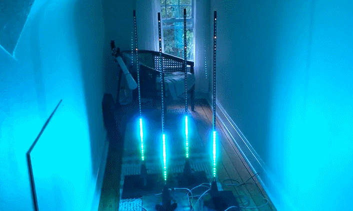
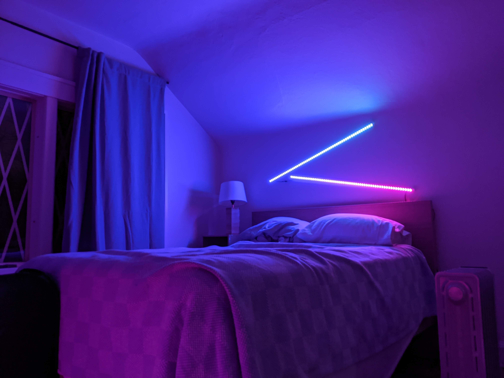
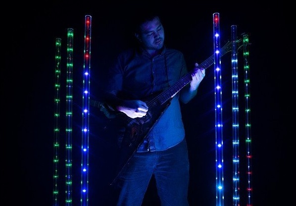
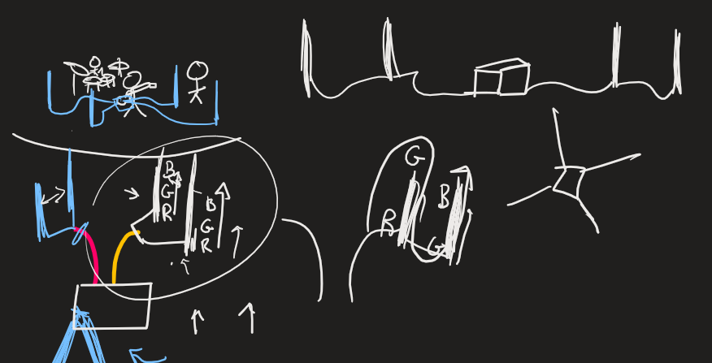
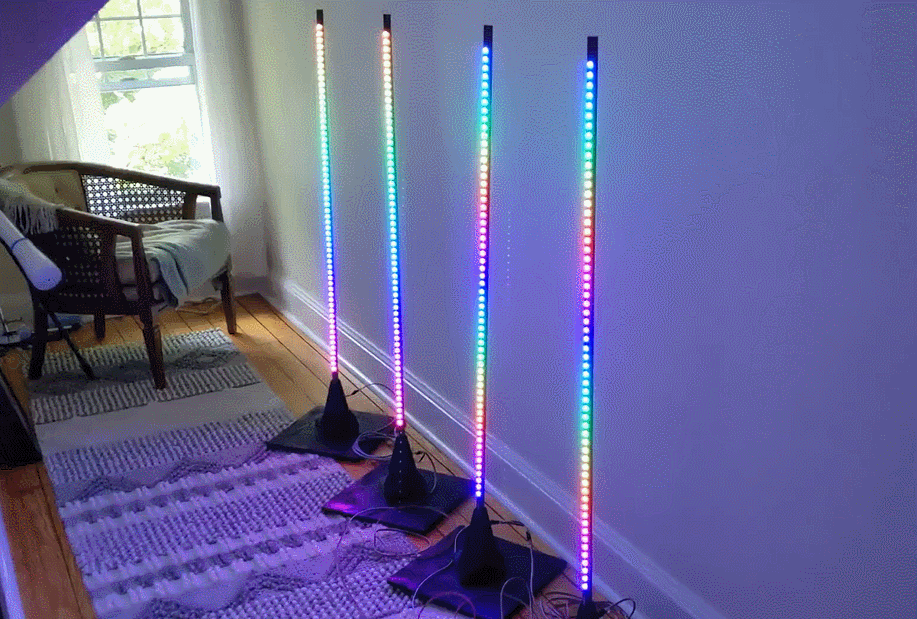
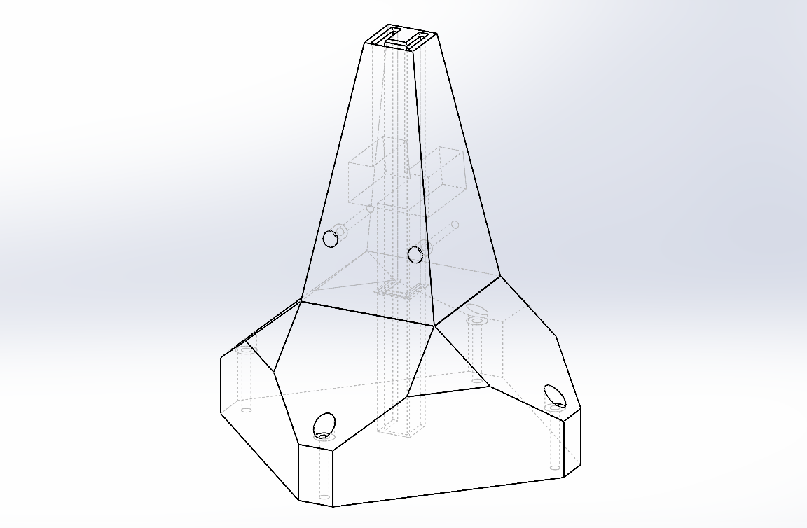
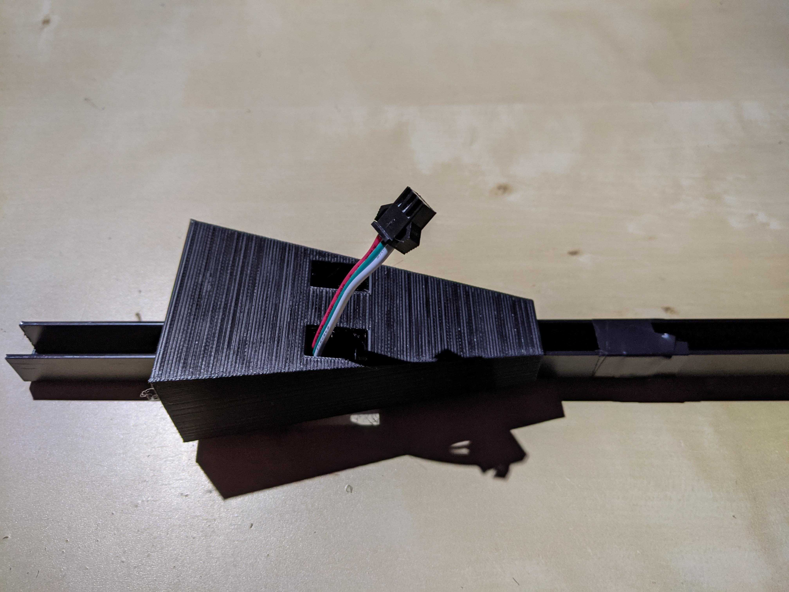
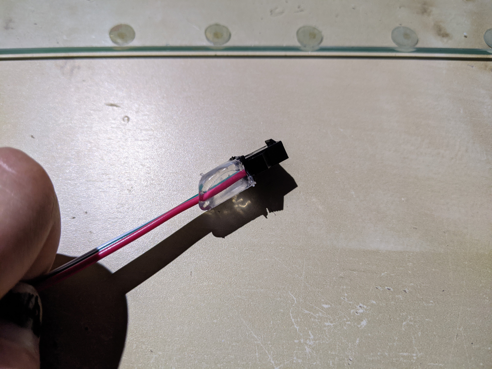
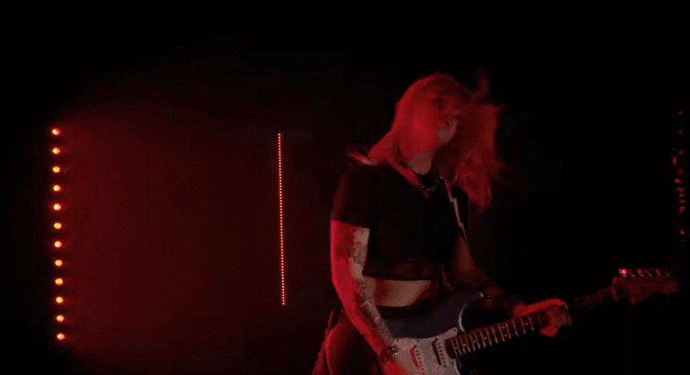

Written 10/16/2021

This project documents some stage lights I made for my friend, musical artist [HALLIE](https://www.instagram.com/hallie_official/).

## Background

We were taking pictures while getting drinks at [B-side on Coventry](https://bsideliquorlounge.com/about/) when we realized we shared a love for blinding neon.

I showed some pictures of my own lights and she said she would love some for her shows.

## Design

So I have my own lightbars that I made for general purpose use. The original idea was to ████ █ ███ ████ ████ █████ ██████ ██ █ █████ ███ ████ ████████ ████, but I haven't actually done that yet. I currently use them as portable accent lighting, and decoration for my rooms. You can get some really cool effects with them pointed directly at the viewer, especially because they are so bright. the WS2812b lights I use run on 5V, so I can power them with a portable USB power bank for a relatively long time.

My own lights are usually set up by leaning them on something. I don't usually have any requirement for fast setup or teardown. However, with Hallie actually wanting to use these as part of a stage ensemble, we had to come up with a solution that makes sense. They had to be tough, but still stable. purchasing tripods was an option, but a little pricey. Some 3D printed solution was probably the best.

I also took a look at some prior art in the realm of freestanding stage lighting. The [Chauvet DJ Freedom Sticks](https://www.chauvetdj.com/products/freedom-stick/) go [for $600 for a set of 4](https://www.stagelightingstore.com/led-lighting-packages/99305-chauvet-dj-freedom-stick-pack). They are DMX-compatible, WiFi controllable, individually battery powered. These are probably the gold standard of what I was going to make, except I would go for a higher pixel density. 30/meter is way too sparse. 

## Control

My first idea for controlling the lights was lofty and involved. I wanted it to be just as clean and easy to use as the professional ones, but that was going to require some real trickery. Each light stand would have its own microcontroller, an Arduino Nano that would drive them. The battery could be self contained, or feed from a central power supply. The only kind of connector between things would be USB-C for robustness, even though it wouldnt use the protocol. It would just eliminate need for orientation.

The brain would be a Raspberry Pi hosting a web server and acting as a router, so you could connect over wifi and view a page on node that would manage the light control. Changing the lights would send serial data to the connected arduino nanos. The individual nanos could be skipped by simply having a single arduino with enough PWM outputs on the central hub, but each light would have to be connected to it constantly. Power would also be centralized.

I tallied up the cost of parts and the probably 20 hours of coding I would have to do to make a functional web server hosted on the access point, and got some number around like $400+. This was, to Hallie, pretty unacceptable. She pointed out that there are commercially availible light controllers that function over bluetooth. This was, as I had not actually done research on the low end, news to me. I immediately realized that was a much better idea, even though it gave less control over the lights, but it opens things up to Hallie for easily programming them on her own. Plus it came with a handy remote.

## Construction

Finally, the part you are looking for. I made four lightsticks, but this could easily be expanded.

### Parts List

- 5V Addressable RGB Light strip 60 px/m black
- 5V 15A Power Supply
- 3-wire extension cable 22 AWG
- Bluetooth-enabled Addressable RGB Light Controller
- JST Connector pack
- 2x 8ft x 3/16 in aluminum C-channel
- Matte Black Spray Paint
- Black PLA
- 4 ft^2 of 1/2 in plywood sheet
- Wood screws
- Electrical Tape
- Soldering equipment
- Hot Glue

### Physical Preparation

Cut the wood sheets into four squares, roughly a foot on each side.

Cut the aluminum channels in half, creating four 4ft-long sections.

Paint these all black with the spray paint. Use many light coats and let them dry between applications. Avoid runny paint or soaked spots.

I designed some basic parts in Solidworks. These would serve as the mount to the wood panel, as well as the cover for the ugly wire joint on the bars themselves. The slide to disconnect would make packing them up easier.

Print them out with black PLA. Be mindful of the long print times and dont mess them up. I used 3 perimeters, 0.15mm layer height, and something like 10% infill. I had to do a couple prints to make sure that everything had proper fit and tolerances, but things worked out.

Next we will work on the lights. Cut the strips into 1m (60px) lengths (there are handy solder joints after every 30 LEDs, so you just need to find those) using some good wire cutters. Make sure you leave enough  of the pads to get a good solder joint. Next you can use the included adhesive to stick them onto the aluminum rails. Make sure the control direction is correct. Offset the end of the lights about an inch from the top of the pole.

Once the lights are on, you can solder short connector wires to them. 

You will then have to do a lot of crimping and soldering to get JST on the extension wires. I cut about 9ft lengths of the wire, which was my rough estimate of how much it would take to cross a stage at the venues Hallie usually performs at. I know they are pure crimp connectors, but a drop of solder will make that connection much more reliable and i always make sure to have it. Additionally, after the crimped connectors are inside the plastic housing, I put a drop of hot glue around the joint to keep them from pulling out of the plastic during use.

Once the connectors are done and on, you can add the 3D printed parts to the base of the lights. insert the aluminum into one of the bases, and then fasten the cover on the aluminum so that the cover is flush with the base. A dab of hot glue might be perfect to make sure that nothing shifts.

At this point, I try powering on the lights. Sometimes the underside of the cables or pads will be in contact with the aluminum, or some stray strand of conductor is shorting something, so I go around with some electrical tape to secure all the connections. Some electrical tape around the top and bottom of the LED strips also keeps them from peeling off the alumunum...but make sure to use good electrical tape.

## Usage and Testing

Here are some images. 

Hallie used the lights a few days after I finished them for [her new song release New Age](https://www.youtube.com/watch?v=gKvBhw2AXuw).

Here is Hallie's first live show where she used them, Friday September 24th at [The Basement](https://promowestlive.com/our-venues/the-basement) in Columbus OH. 

Thanks for reading! Leave a comment about what you think, or what might have been done differently.

