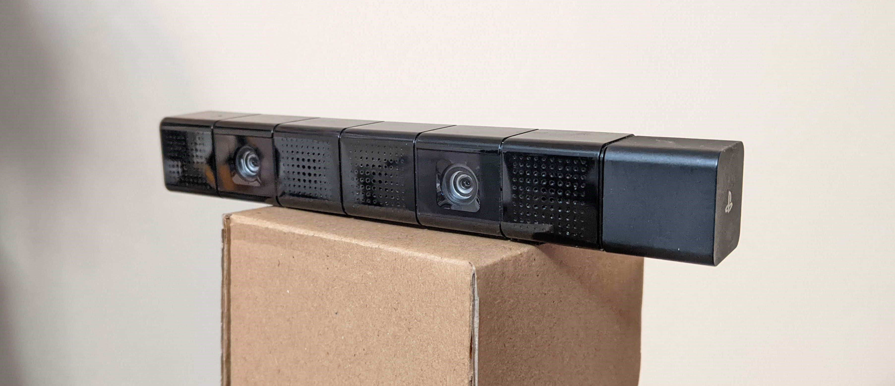
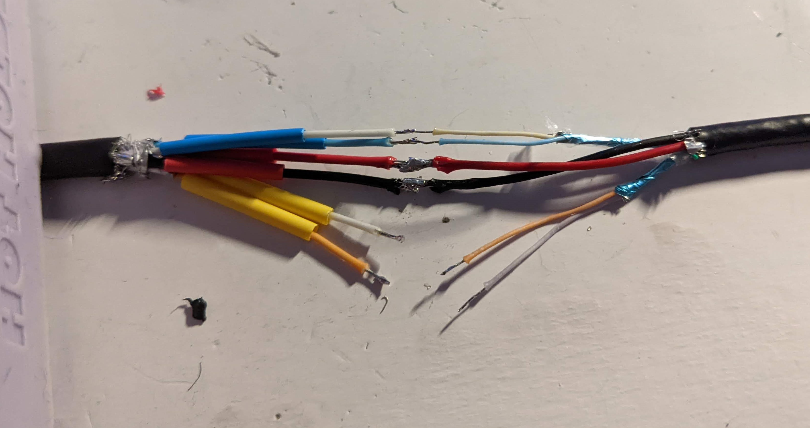
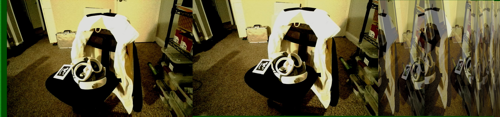
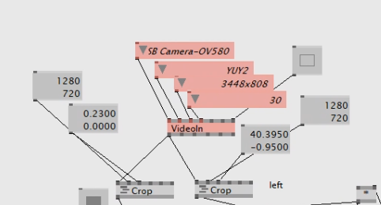

Written October 2023

## Quick Intro

In 2021 I found a strange device in a box labeled 'free' sitting on the curb. That device turned out to be a `CUH-ZEY1` PlayStation 4 Camera. This is a pair of 1280x720@30fps cameras with a hardware-synchronized shutter, a microphone, and an encoder board.

I tried to use this camera. I fumbled about in 2021, didn't really understand anything, and gave up. I came back to it this month after learning OpenCV for stereo vision at work. This is a record of information I learned.

### Research

As I started lining up usernames in the availible research, [Antonio José Ramos Márquez "bigboss"](https://psxdev.github.io/index.html) was the primary force in documenting this camera's software. Antonio documented things here: 
- [Part 1: (2014, updated) initial hardware reverse, linux with libusb](https://psxdev.github.io/luke.html) 
- [Part 2: (2016) Windows driver development](https://psxdev.github.io/luke2.html)
- [A blogspot post about similar stuff to part 1, on mac](http://bigboss-eyetoy.blogspot.com/2015/02/reversing-playstation-4-camera.html)

The rest of the ps4eye group recorded things on [a group Tumblr blog, which includes the rewiring](https://ps4eye.tumblr.com/)

Sieuwe Elferink "sieuwe1" used this work to make his [instrutables](https://www.instructables.com/HACK-PlayStation-4-Cam-Into-Cheap-3D-Depth-Camera-/), [youtube](https://www.youtube.com/watch?v=c7CF6eDC0_A), and [github](https://github.com/sieuwe1/PS4-eye-camera-for-linux-with-python-and-OpenCV) tutorials later. On his github he credits the original group. I find myself frustrated with the clickbaity appearance of his content. I also find it less genuine. However, it is easily found when searching on the internet, and gets more traffic as it ony goes as deep as it needs to to get things running. 

## Hardware Hack

First you need to connect the camera to your computer.

Option 1 is to [order a custom PCB that @alvaroprieto designed.](https://oshpark.com/shared_projects/0PjWmdWL) You will need to purchase the USB and PS4AUX connectors separately.



Option 2, which was the one I did, was to cut off the Sony-proprietary 'AUX' connector on the cable and solder it to a USB-A 3.0 cable. Just connect the cables to the same colors if your replacement cable follows spec. USB3 Standard is as follows, note that the AUX connector does not use the USB2.0 fallback pins:

|  Pin |	Name 	    | Direction |	Color |	Description | Used in PS4Eye? |
| ---  | ---			| ---	| ---	    | 		---		            | --- |
|  1 	|   VBUS     	|   	| red   	| +5 V power                | Y |
|  2 	|   D- 	        | ←→ 	| white 	| USB 2.0 Data -            | N |
|  3 	|   D+ 	        | ←→ 	| green 	| USB 2.0 Data +            | N |
|  4 	|   GND      	|   	| black 	| Ground                    |Y |
|  5 	|   StdA_SSRX- 	| ← 	| blue  	| SuperSpeed receiver       | Y |
|  6 	|   StdA_SSRX+ 	| ← 	| yellow 	| SuperSpeed receiver       | Y |
|  7 	|   GND_DRAIN 	|   	| ground 	| Ground                    | N |
|  8 	|   StdA_SSTX- 	| → 	| purple 	| SuperSpeed transmitter    | Y |
|  9 	|   StdA_SSTX+ 	| → 	| orange 	| SuperSpeed transmitter    | Y |

A last note about connecting to your PC - it _really_ needs to be USB 3.0. And some things you THINK are 3.0 aren't. My Type A-C converter wasn't. My PC front IO wasn't. My Type C-A converter I was using for an extension cable wasn't. That was a stupid few minutes, but eventually I figured out the combination of adapters that got things working.

## Installing on Windows:

### Do Once

1. Clone Antonio's [OrbisEyeCam git repo](https://github.com/psxdev/OrbisEyeCam/tree/master)

2. Run `OrbisEyeCam/bin/InstallDriver.exe` from OrbisEyeCam
    - This was generated using libusbk. You can follow his steps to generate your own, but I don't think its necessary.

### Each time you power on the camera

1. Run `OrbisEyeCam/bin/OrbisEyeCameraFirmwareLoader.exe`
    - When the PLC board is first powered on, it goes into bootloader mode and waits for the device to load firmware onto it. The firmwareloader program does this.

    - You could also use python to load the firmware and start automating things. This is shown in some of the other tutorials. However we are in Windows user fun area so just double-click it.


### To get data

Windows driver camera apps will show each frame weirdly, like this:



This is how it is supposed to look. See near the end of [this page](https://psxdev.github.io/luke2.html) what each section of the frame is. The python decoder for the 1280x720 is simple, from [sieuwe1](https://github.com/sieuwe1/PS4-eye-camera-for-linux-with-python-and-OpenCV/blob/main/OpenCV_viewer/View_Depth.py):

```
def decode(frame):
    left = np.zeros((800,1264,3), np.uint8)
    right = np.zeros((800,1264,3), np.uint8)
    
    for i in range(800):
        left[i] = frame[i, 64: 1280 + 48] 
        right[i] = frame[i, 1280 + 48: 1280 + 48 + 1264] 
    
    return (left, right)
```

I also wrote a decoder in VVVV, which I was using back in 2021 for vfx stuff.



From here, I would just go straight to OpenCV. They have many tools for dealing with video streams quickly. [sieuwe1's Github](https://github.com/sieuwe1/PS4-eye-camera-for-linux-with-python-and-OpenCV/tree/main) contains good examples. You should be able to just run the viewer code.


Thats not great! Look at sieuwe1's results: 


I wrote more code for calibrating my specific camera, in case the intrinsics that sieuwe1 generated were different, but this did not seem to help. I also changed parameters for the StereoSBGM solver to try and get better results. These had little effect and may have shown that the noise was the issue.


You can see it compared to the Intel Realsense D435 camera shown on the right. Notice how I turned off the IR emitter, this is in pure stereo mode. The difference is insane.

I tried filtering out the noise with `cv.fastNlMeansDenoisingColored` but this was very slow on my CPU. It also didn't improve much. I started recompiling OpenCV for GPU but this was also where I started doubting my wiring, and cut and resoldered the cable making sure to length match everything as best I could. This did not improve anything.

This is where I am giving up. I think the camera was in a 'free' box for a reason. It doesn't work right.

## Other platforms

Other platforms were documented in a more centrallized manor.

For Linux, follow instructions in the [ps4eye github](https://github.com/ps4eye/ps4eye). I tried this with a RPI4 (which has USB 3.0) but obviously it wasn't fast enough for any good OpenCV performance. You would want something with a GPU like a Nvidia Jetson or similar.

For Mac (made for the 2013-2016 OSX Mavericks, but probably works for more), use the reference driver Antonio wrote [in this github repo](https://github.com/bigboss-ps3dev/PS4EYECam)