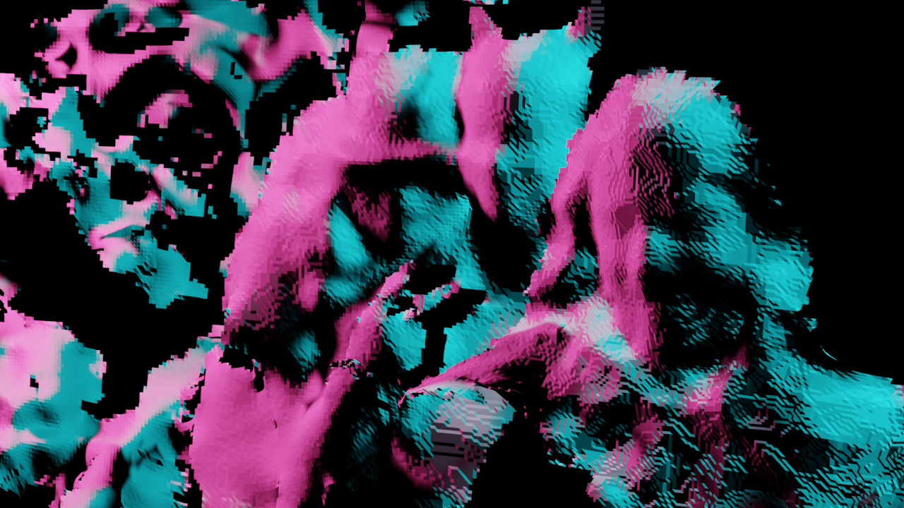

Written November 2023

## Introduction

Previously, [I had pretty rotten luck with a hacked stereo camera](/projects/ps4-stereo-camera/). My frustration caused me to search for a hardware alternative, which I found as the [Intel D435](https://www.intelrealsense.com/depth-camera-d435/). It seemed like a pretty solid platform, had a well-supported API, did processing on the hardware, and a lively developer community. I grabbed a used one off amazon for $160. This post will document how I got it working for the various things I want to do with it.


*Aside - the first package was stolen off my apartment's mailbox. That was annoying, but the seller replaced it at no charge. I later found the original opened box in the locked recycling area for my building >_>. A thief is afoot!*

## Get Started


Dead simple. [Intel has a Get Started page.](https://www.intelrealsense.com/get-started-depth-camera/)

- [Install on Windows](https://github.com/IntelRealSense/librealsense/releases/latest)
    
    Remember, you can either just download the viewer exe, or more likely you will want to download the SDK install exe. This will install the viewer, as well as C++ and Python library bindings.
- [Install on Linux](https://github.com/IntelRealSense/librealsense/blob/development/doc/distribution_linux.md)
- [Install on RPI](https://github.com/IntelRealSense/librealsense/blob/development/doc/installation_raspbian.md)

With the RealSense Viewer installed, you can take color/depth photos, which can be saved as images or as point clouds. These can be opened with a tool like [MeshLab](https://www.meshlab.net/) to do cool things.


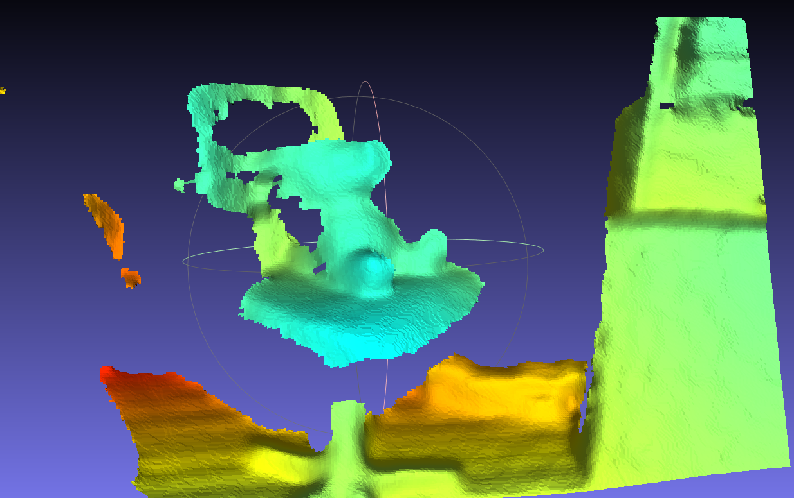

The recorded video files are ROS `.bag` files that can be played back in [rviz](https://wiki.ros.org/rviz), or if you dont want to install all that, just drag and drop the file into [webviz](https://webviz.io/app).


### Calibration

*Note: I did the tasks in this section after doing my scanning experiments I'm putting it here, because this is where I SHOULD have done it!*

[Intel documents their calibration.](https://dev.intelrealsense.com/docs/calibration) "It may indeed never be required", but "exposure to extreme temperature cycling, or excessive shock and vibe" can make it a necessity. I bought a used camera. Lets see what happens.

The specific procedure I followed was the [Tare+Calibration with Ground-Truth Target](https://dev.intelrealsense.com/docs/self-calibration-for-depth-cameras#addendum-a-march-2022-tare-calibration-with-ground-truth-target). But before you can Tare, you should calibrate focal length.

*"the limiting factors on GT accuracy are the target size and camera focal length. Any errors in either of these parameters directly affect the GT result in a linear manner, e.g., a 0.1% error in F or XT translate to a 0.1% error in GT."*

I printed out the [Ground Truth Target (with the four dots)](https://dev.intelrealsense.com/docs/self-calibration-for-depth-cameras#ground-truth-targets-and-printing--mounting-instructions) which can be used for all three types of calibration. It provides static reference points for the FL calibration, provides known lengths for calculating the actual distance to the wall (tare), and then it has a non-repeating noise pattern to perform accurate calibration. I measured the distance between the points on my print, which were accurate enough within a tenth of a mm. I mounted it to the wall a bit short of one meter away, as Intel reccomends for the D435.

I ran the FL calibration first.

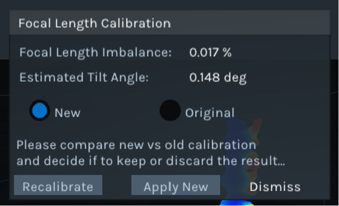

*"FL imbalance result is generally accurate to within +/-0.03%...FL errors much larger than +/-0.2% are recommended to be corrected"*

Perfect! We are well into the high-accuracy territory. This evaluation did not provide me with the old value, so we will just have to be glad our new result is good.

Next, without even moving the camera, we can click Tare Calibration. I am using this with good even lighting in the room and the IR pattern on, the docs say this should give best results.

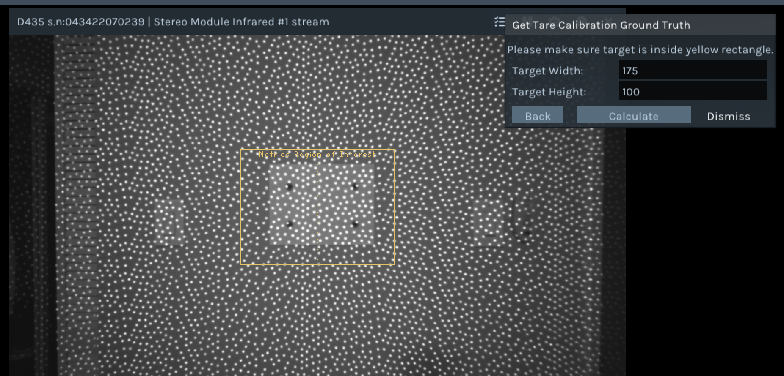

```
// The first Tare Calibration I ran - I had not done Focal Length Calibration yet
Health check numbers from TareCalibrationResult(0x0C): before=0.007776, after=-0.001151
Z calculated from health check numbers : before=827.688354, after=820.356750

// After FL Calibration, I ran it again.
Health check numbers from TareCalibrationResult(0x0C): before=0.000396, after=0.000396
Z calculated from health check numbers : before=821.187927, after=821.187927
```

Woah! our original health check was 0.7776%! After the FL and Tare Calibration, we got it all the way down to 0.0396%. Lets see how these values compare with Intel's reccomendations... 


Wow! I actually needed to do that! That might explain some issues I'm going to have later in this post.


## 3D Scanning

One of the first applications that someone with a depth camera wants to do is scan stuff. You don't have to write any code, people already did that! I was looking for open source, or at least free applications that would let me take bad scans that I can manually clean up. I don't need dimensional accuracy - sometimes I just want to get something into the computer!

### Getting a program

- Intel says to just use Dot3D. This costs money and you need an account to download. Lets see what else there is.
- [Skanect](https://structure.io/skanect) is probably the most historically rich free scanning solutions. Relies on OpenNI2. Closed source, you have to pay for more than ~~50,000~~ ***5000*** tris.. Also, doesn't support Nvidia 30-series GPUs or newer for Cuda. That's ok, your CPU is fast enough nowadays anyway. 
- [ReconstructMe](https://www.reconstructme.net/) is free for non-commercial use. Relies on OpenNI2. Closed source.
- [RecFusion](https://www.recfusion.net/) has RealSense API support. Closed source, you have to pay. Welp.
- [Open3D](http://www.open3d.org/docs/latest/tutorial/t_reconstruction_system/index.html) has a depth reconstruction example built-in. This has RealSense API support.

### Compile RealSense Drivers with OpenNI2 Support

When I was testing the programs that relied on OpenNI2, I learned that Intel does not include the wrapper by default. But, [Intel has a page for that!](https://github.com/IntelRealSense/librealsense/tree/master/wrappers/openni2#getting-started) Basic steps:

- Download [OpenNI2 SDK](https://structure.io/openni)

- Download [RealSense2 SDK](https://github.com/IntelRealSense/librealsense/releases)

- Run CMake on RealSense driver and configure environment variables for the SDK:
    * `OPENNI2_DIR` should be the root install directory of OpenNI2. (For linux, the path may be "/usr/include/openni2")

- Generate project files and compile Release drivers

- For Windows, copy `build/_out/Release/rs2driver.dll` and `build/Release/realsense2.dll` to `OPENNI2_DIR/Samples/Bin/OpenNI2/Drivers/`

    *Also, you will have to copy these files to every program's OpenNI2 folder. For example:*

    `C:\Program Files\Skanect 1.11\bin\OpenNI2\Drivers`

    `C:\Program Files\ReconstructMe\bin\OpenNI2\Drivers`

- For Linux, copy librs2driver.so and librealsense2.so to OPENNI2_DIR/Samples/Bin/OpenNI2/Drivers/

I followed those steps, but the OpenNI2 programs were still not detecting the camera. 

### Intel OpenNI2 Wrapper Bugs

I opened the logs, and found some errors. Here is the one from Skanect:

```
INFO: OpenNI2: Device "043422070239" present.
INFO: OpenNI2: Device info: [PS1080] [7463] [1537].
INFO: OpenNI2: Number of devices: 1
INFO: No support for softkinetic, skipping.
INFO: OpenNI2: Opening: 043422070239
INFO: OpenNI2: Number of devices: 1
WARNING: Could not switch to VGA depth mode.
ERROR: OpenNI2: Couldn't prepare depth stream: 	Stream setProperty(7) failed
```

SetProperty(7) allows setting stream mirroring on/off. If they got the `ONI_STATUS_NOT_SUPPORTED` response, Skanect and ReconstructMe just crash. That's stupid. But one of these two things is open source, and its not the scanning application.


[I reported this on the librealsense GitHub page](https://github.com/IntelRealSense/librealsense/issues/12363). Within a few hours they had responded to me! Turns out they don't ACTUALLY care about the OpenNI wrapper, and haven't updated it in a long time. Guess this is in my hands now. Lets see if i can do the dumbest, bare minimum fix - if this doesn't work, I'll just give up and do something else.

I changed two things in the file `librealsense\wrappers\openni2\src\Rs2StreamProps.cpp` :

- Inside `isPropertySupported()` moved `ONI_STREAM_PROPERTY_MIRRORING` to the section of unsupported things (why did they have it returning true before???).

    ```
    case ONI_STREAM_PROPERTY_MIRRORING:
		return false;
    ```

    NIViewer (the viewer that ships with the SDK) is the only program I think that actually respects this. This doesn't do anything for the 3D scanning programs, they still crash. However, I can't handle just leaving it as reporting supported.

- Inside `setProperty()` made it so trying to mirror doesn't do anything, but returns `ONI_STATUS_OK`

    ```
    case ONI_STREAM_PROPERTY_MIRRORING:
	{
		return ONI_STATUS_OK;
		break;
	}
    ```

With these fixes, Skanect and ReconstructMe function just fine. They were probably just turning OFF mirroring as part of initialization. Yay for stupid fixes! 


```
INFO: OpenNI2: Device "043422070239" present.
INFO: OpenNI2: Device info: [PS1080] [7463] [1537].
INFO: OpenNI2: Number of devices: 1
INFO: No support for softkinetic, skipping.
INFO: OpenNI2: Opening: 043422070239
INFO: OpenNI2: Number of devices: 1
WARNING: Could not switch to VGA depth mode.
INFO: Depth Intrinsics: fx/fy/cx/cy [384.152 | 384.152 | 320.000 | 240.000]
INFO: Color Intrinsics: fx/fy/cx/cy [384.152 | 384.152 | 320.000 | 240.000]
WARNING: Could not read device serial number.
INFO: OpenNI2 Status: 
```

If you want to just download my code, [go to the fork on my github,](https://github.com/starmaid/librealsense) or just email me if you just want the dlls.

I will update this page if/when [my PR is accepted into the main branch.](https://github.com/IntelRealSense/librealsense/pull/12412) I dont know if they will accept a stupid hack like this, as returning OK when the thing is decidedly NOT OK is probably not up to standard. But it works for me!

### Actually Scanning Stuff

Each of these programs give varying results. Things seem very dependent on lighting, and the software has a lot of difficulty. In general. Lets try scanning Pyralspite.

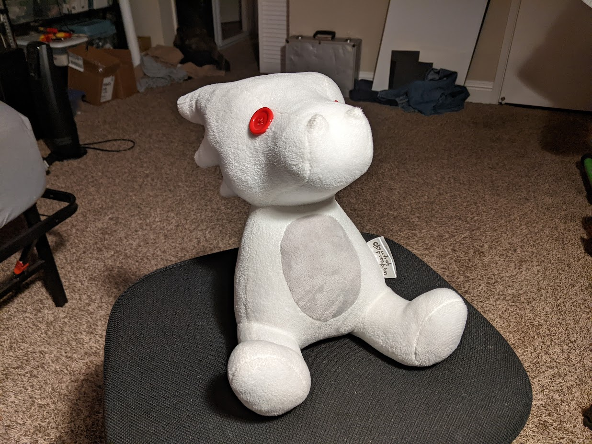

Smooth curves, some visual interest (fuzz), and relatively matte. The white color may be killing me, but from just looking at it through the camera, it seems to be able to capture depth pretty well. For more practical reasons, this is something I want a 3D model of.

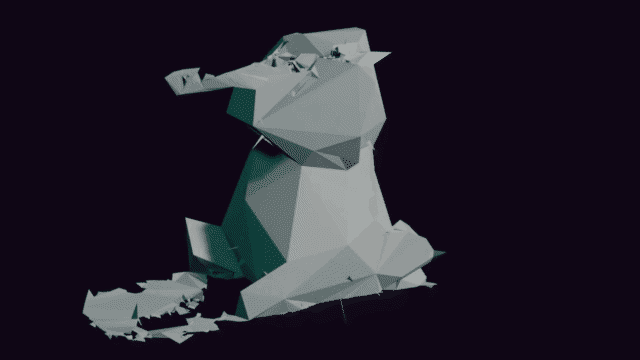

Wow thats godawful. Not only is that 5000 tri export limit really killing me, but the software lost tracking several times and wasted geometry on trying to rebuild different sections of the plush.

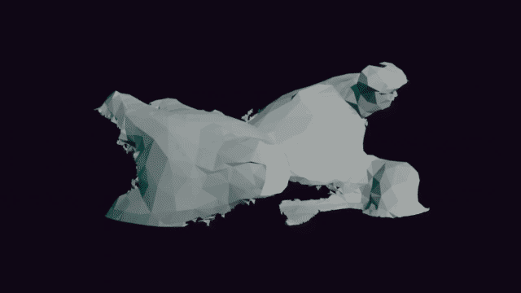

We can see that from a different angle, and ONLY that angle, the scan is pretty good! Maybe something is wrong with my technique, or lighting, etc. Lets just look around the room.

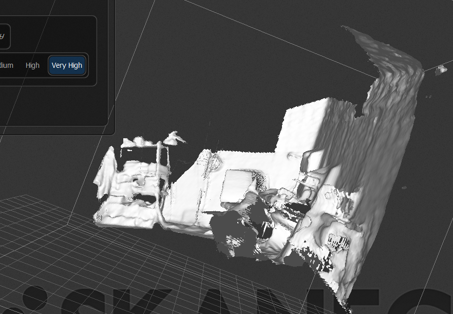

Why is the wall tilted? Why does the tilt change? who knows. I had the camera on a tripod, and the floor was cut out alright. I wonder if I need to **calibrate the camera...**

Lets try ReconstructMe.

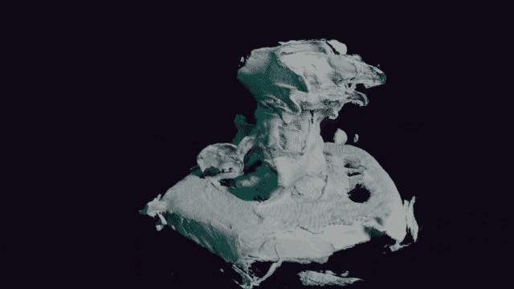

No export limit on the mesh, so you can see more of the crap I left in there. It fully lost tracking once, and then just...recreated the mesh again, about 50 degrees offset. And it kept parts of both. Seems to have used the head spikes+foot as a locating point, and now theres three of each. Lets scan something else?

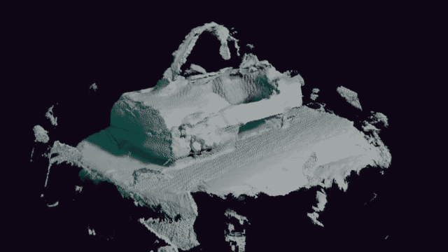

A VR headset! It tried to do the same thing - it fully lost tracking, and the model you see here is actually the SECOND time it generated this mesh in one scan. Not great. Maybe my technique is bad...

RecFusion, while it was free to download, did not let me export meshes. Welp. Heres a plant I tried to scan.

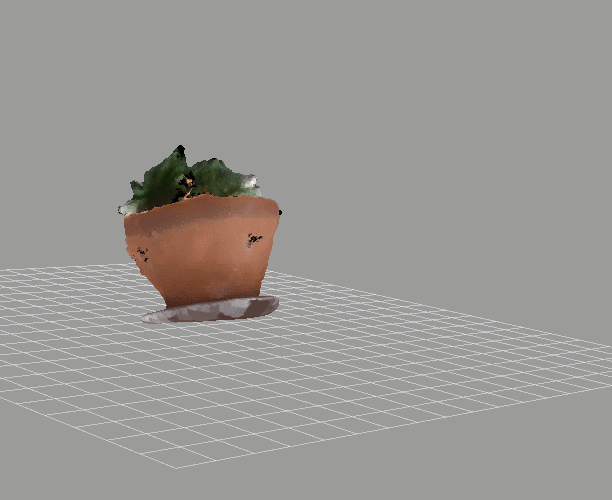

The user interface was hard to use, and the scan wasn't great. No reason to purchase this software I think.

In the future, I may simply just take single photos, and align them manually in MeshLab when I actually want to scan stuff. The state of the industry is not perfect here, perhaps I'll perfect a setup and try this more.

On the other hand, making cool glitchy stuff may be the way to go here. At least it will be fresh and interesting.

## Future Stuff

I've owned the camera for two weeks, and I haven't done the things I actually want to do with a depth camera! However, this post is already long enough. In a later post, I will generalize into the applications and not spend time on the sensor specifics. A preview:

### Python Bindings

Ok, so you can take pictures and videos. If we want to do something interesting, we have to manipulate the feed directly.

[Intel Python Developer Ref](https://dev.intelrealsense.com/docs/python2) and [Install pyrealsense2](https://github.com/IntelRealSense/librealsense/tree/master/wrappers/python#installation) pages. They say something about the RealSense SDK for Windows including the Python bindings. But literally all you have to do is `pip install pyrealsense2` so its not that hard. From there, the camera data is just a Numpy ndarray.

### Streaming to Three.js

I want to read the depth data to play with during livecoding visuals. This is in progress as I still have to learn [Three.js](https://threejs.org/).

### Human Pose Estimation

Estimating pose from cameras is one thing, but it should be even better with a depth camera right? Lets see if we can make animations for characters in Blender. If we could do it live for VRChat, that would be even cooler.
