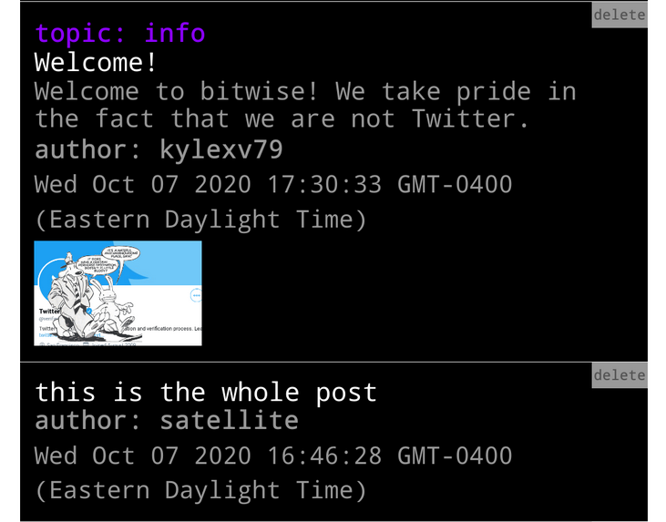
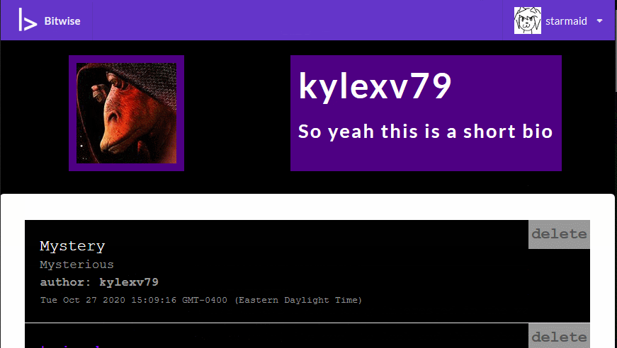
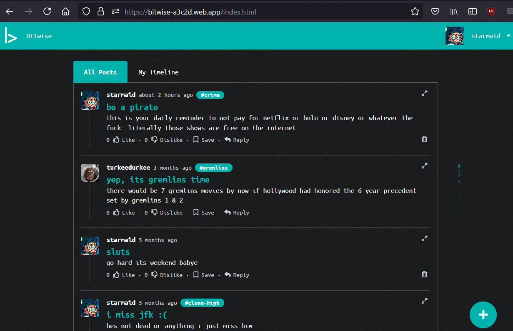
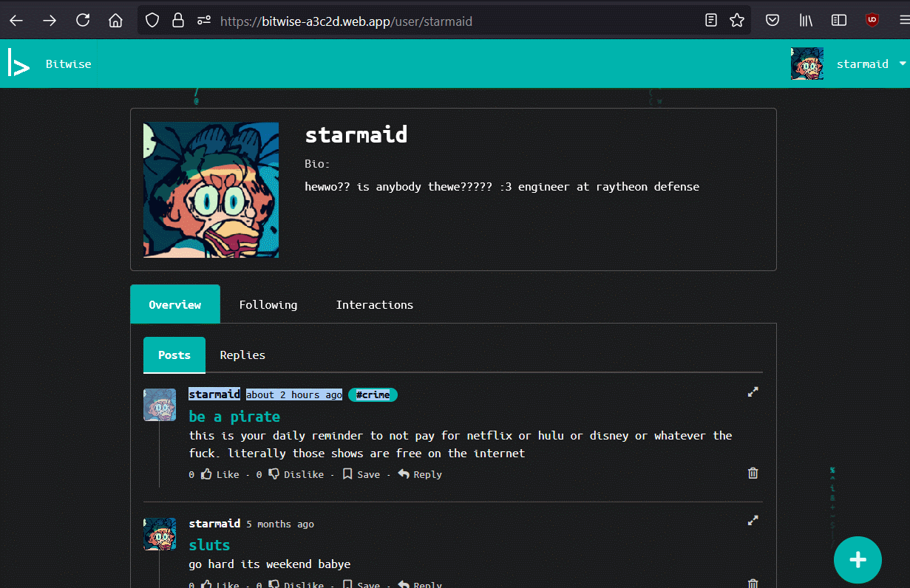
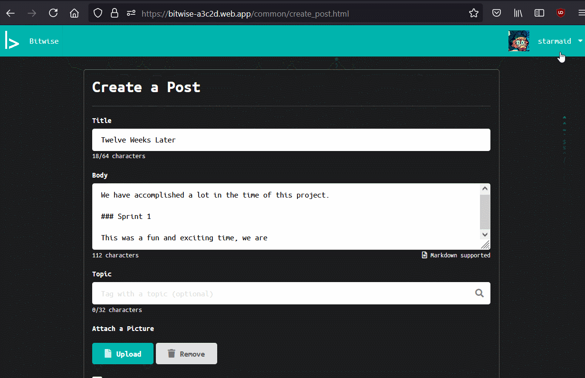
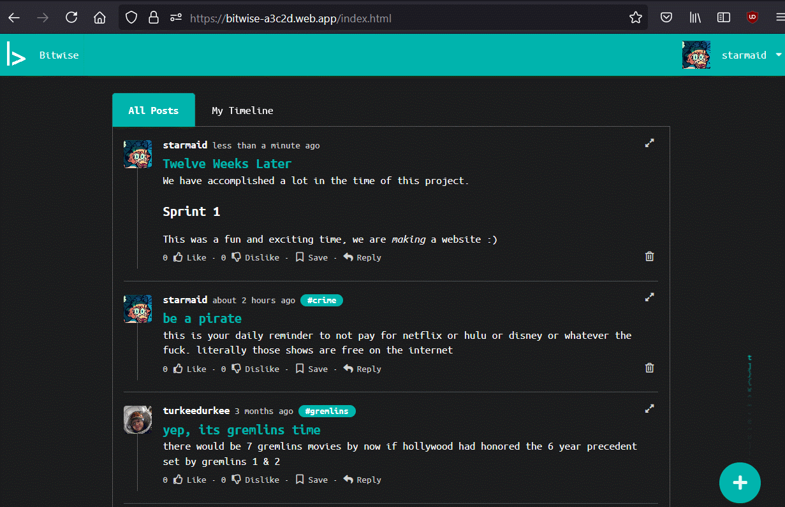
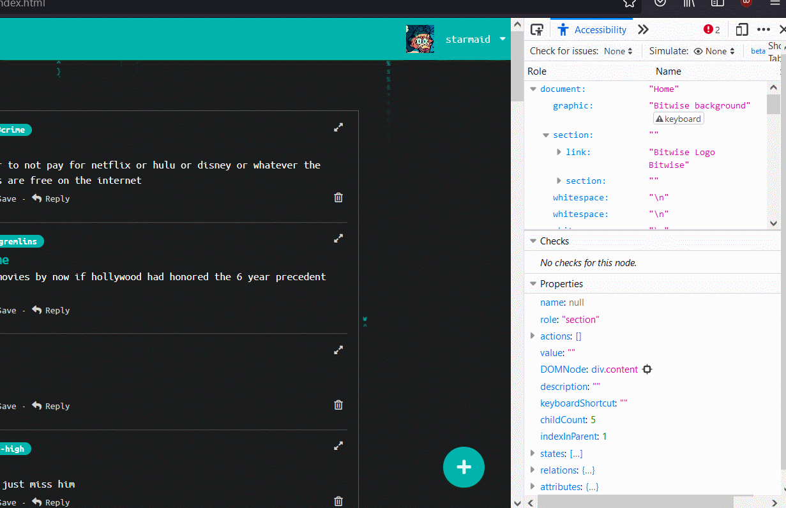

Written January 2021

[Link to the site](https://bitwise-a3c2d.web.app/)

[Link to the project github repo](https://github.com/mchartigan/bitwise/)


## Introduction

Purdue University's **CS 307 - Software Engineering** is an upper-level elective that satisfies requirements for majors and minors in the college of Computer Science. I decided to take this class in Fall 2020 as my last requirement of my CS minor, as I heard good things about it, and was excited to be able to create a functional application with a group of other students. As of Spring 2020, the class involved a proposal for the application or website the students wanted to design, where they would set their own goals and work towards them. However, over Summer 2020 this was changed to a more rigid set of requirements that did not leave much room for innovation. Although my team was dissapointed to learn this, we were releived to have many resources availible for the project assigned.

Our team consisted of five members:

- [Mark](https://mchartigan.github.io)
- [Zach G.](https://github.com/zgeorge22)
- [Zach M.](https://github.com/zmcclary1205)
- [Kyle](https://github.com/vandewak)
- and me!

The requirements, while many, boiled down to two simple words: *"make Twitter."* Short posts, images, timeline, liking, commenting, following users, tags, topics, etc. All social media sites nowadays follow this pattern, and we were assigned to add our platform to the mix. Our TA, Sid, suggested that we use Google Firebase as our platform, as they do the hosting and database management for users. This would come in handy, as our team had almost no experience in web development. We all had similar "I made a single page plaintext website in HTML in 2009" story, and I had done a little work with wrapped/unwrapped client APIs for Tumblr, Twitter, Discord, and Tenable.io. But this would be nowhere close to get us through developing an entire social media platform.

The project was broken up into three 3-week sprints, with a week between each one to write planning documents and retrospectives. These sprints are longer than the typical one-week professional sprints, but remember we are full-time students taking four other classes. The amount of time dedicated to the project over those three weeks was expected to be roughly 30 hours per person, equating a perfect 6-hour, 5-day workweek. 

The rest of this page will delve into the details and descisions made while building this site.

## Development

I know the history is all in github, but I want to write it out here so others can read it and get a little insight into our process. 

### Pre-Sprint 1

Firebase tutorials, javascript intro courses, doing basic things to learn the landscape. We had a fair amount of fear going into this project, but as we learned the basics that slowly dissolved.

If you are reading this page planning on making your own firebase project, MAKE YOUR FILES A REACT PROJECT FIRST, THEN ADD FIREBASE TO THE REACT PROJECT. This prevented us from making a full react app, and had to use CDNs for things we ideally would not have.

### Sprint 1

**Goals:** Basic UI, user accounts, posts, profiles.

I was very excited to get started on the site, and I was also the only member of the group who already had a Google Cloud Developer profile. I was able to make the Firebase project while sharing my screen with the team, because I didn't have to mess with connecting my bank account and stuff and it realy streamlined things. I was also able to get the first database calls out with the Firestore API, and pointed the group to the places I implemented them. 

Take a look at this section of code from the timeline page. I wrote this while referencing a tutorial that used list items to make a single page JS app. 

```js
// find the timeline by ID
const postList = document.querySelector('#timeline');

//...//

// create an HTML list element to store this post
let li = document.createElement('li');

// add children to this list element with post content
li.appendChild(topic);
li.appendChild(title);
li.appendChild(content);
li.appendChild(author);
li.appendChild(created);
if (doc.data().image != null) {
    li.appendChild(img);
}
li.appendChild(cross); // delete button

// add the post to the post list
postList.append(li);
```



This section of code worked. Querying the database, creating a HTML list, and adding it to the DOM works! This was a way to access the database, and then we could do other tests like modifying, adding, and removing data and then checking by reloading the homepage. We were working with what we knew, and that was barebones HTML. Its just very hard to do anything afterwards with this model, there was no room to grow. This was one representative piece that really shows the mood of what we had at the end of the first sprint. 



While I was starting to get the database working, Mark was hard at work on authentication, and Zach G and Kyle were getting their hands dirty learning how to style things and even a little bit of Semantic UI and React. 

By the end of the sprint, users were able to create an account, see their posts on their profile page, see other users posts in reverse chronological order, as well as make posts. Things were rough around the edges, but I think it would fall under "Minimum Viable Product" for a first sprint - and certainly much further than we thought we would get.

One of the bigger issues we had this sprint was redundancy while coding. The cause was when a team member pulled from Github, and then would go several days while working on a large change. Then, they would push that change, and would have reinvented the wheel to do something that was solved in the days since they last merged. This happened twice in this first sprint, and was a real wakeup call on how to work in a collaborative group project remotely like this. It was also perhaps a symptom of the large amount of work that has to be done in creating a webpage, which soon turns into modifying things that already exist when the site is extant. Either way, this problem did not come up again. 

### Sprint 2

**Goals:** 

The conversion to React elements for the whole website was our next big project. Zach G and Mark spearheaded this effort, and did some amazing work on creating these dynamic elements. Mark attempted to turn the firebase project into a react project, but that didnt quite seem to work. The proper order should be to create a React.js project, and then add Firebase integration. To get the functionality though, he was able to implement React without making the whole project compliant.


Zach, who then got to work on converting the UI elements, kept the basic design of the pages as we outlined in the first sprint. Keeping in mind the objective of having a light mode/dark mode, he added some top-level variables that would set the color of UI elements dynamically. He also recreated the Post as a react element, with much more functionality and some visual responsiveness to actions. This was completed with the Semantic and Fomantic UI elements. 

One of my main tasks was to get unique pages for users, topics, and posts. I wanted to use the CRUD method, with a `bitwise.com/user?u=USERNAME` kind of layout that would grab that POST data and give you back the necessary information from the server. However, I was having issues with how firebase Functions work, and they cant call the `sendFile` function, as the Firebase Functions run in their own sandbox away from the website data. I could have worked them harder to do both a redirect and then a function that would run on the same event, but we were on a tight schedule with many other tasks to cover.



Here is the Firebase Function I attempted to use for the page redirect.

```js
exports.user = functions.https.onRequest((req, res) => {
  // OLD USER PAGE RESPONSE CONTENT
  // DOES NOT WORK ON PRODUCTION SERVERS
  // isolate the username we are looking for
  var urlstring = req.path.split('/');
  var username;
  if (urlstring.length === 3 && urlstring[1] === 'user') {
    username = urlstring[2];
    // search the database for that username
    if (username === "null") {
      res.status(200);
    } else {
      db.collection('users')
      .where('username', '==', username).get()
      .then(querySnapshot => {
        if (querySnapshot.empty) {
          // user not found
          res.status(404).sendFile('./public/404.html', {root: '../'});
  
        } else {
          // querySnapshot.docs[0].id;
          res.status(200).sendFile('./public/common/profile.html', {root: '../'});
        }
      });
    }
  } else {
    res.status(404).sendFile('./public/404.html', {root: '../'});
  }
});
```

I changed the URL style to `/user/[username]` to trigger a rewrite event in Firebase. The solution is to do a rewrite in the `firebase.json` config file that takes wildcards and sends them directly to the template pages without changing the url that appears to the user. 

```json
{
  ...

  "hosting": {
    "public": "public",
    "ignore": [
      "firebase.json",
      "**/.*",
      "**/node_modules/**"
    ],
    "rewrites": [ {
      "source": "/user/**",
      "destination": "/common/profile.html"
    },
    {
      "source": "/topic/**",
      "destination": "/common/topic.html"
    },
    {
      "source": "/post/**",
      "destination": "/common/post.html"
    }]
  },
  
  ...
}
```

This is not a solution on its own, as the profile/topic/post page then has to understand what data you want to view. This is accomplished with some quick JS code in the beginning of the page script.

```js
var urlstring = window.location.href.split('/');
var viewname = null;

firebase.auth().onAuthStateChanged(function (user) {
    // always runs when a firebase-hosted page is loaded for the first time.
    // also runs when the user logs in, which is important for profiles 
    UID = user ? user.uid : null;

    // get user's theme preferences, then...
    loadTheme().then(() => {
        bg = new Background();
        refreshHeader();
        // load page content
        ReactDOM.render(<Page />, document.getElementById("page"), pageMounted);
    });
});

function pageMounted() {
    // runs when the DOM is rendered
    if (urlstring.length === 5 && urlstring[3] === 'user') {
        viewname = urlstring[4];
        // search the database for that username
        if (viewname === "null") {
            // if not found, redirect the user to the 404 page.
            window.location.replace('/404.html');
        } else {
            db.collection('users')
                .where('username', '==', viewname).get()
                .then(querySnapshot => {
                    if (querySnapshot.empty) {
                        // user not found
                        window.location.replace('/404.html');

                    } else {
                        // continue along loading the page
                        viewUID = querySnapshot.docs[0].id;
                        loadPage();
                    }
                });
        }
    } else {
        window.location.replace('/404.html');
    }

    // change the window title to the user you are viewing
    document.title = viewname;

    // Initialize dynamic tab groups
    $('.menu .item').tab();
}
```

This template is very similar for the post- and topic-specific pages, with only calls to different databases. Looking at this section, you might quickly see the major drawback. If you try to navigate to a user that doesnt exist, the webpage is already *fully loaded*, and you also have to wait for Firebase to get back with the "not found" message **before** you can even redirect to the 404 page, which then still has to load. Like I mentioned earlier, a quick Function may have been able to do some of this work and then send the profile page along with some JSON data that would make things a lot faster.



Other tasks that were covered include all post interactions (liking, disliking, saving, and commenting) which used some really nice linked list techniques in the database. 

### Sprint 3

The third (and final) sprint had more integration that the previous two sprints did, as well as a fair amount of cleanup that was required to make the site as a whole functional and achieve the requirements we set for ourselves. 



One great improvement that Mark made was implementing Markdown formatting and image attachments to the post utility. This makes the posts have so much more power, moving from something as limited like twitter to a more powerful platform like Reddit or Tumblr. Both Zachs worked on improving the Delete button, which lacked any confirmation or even removing the post from the screen. Now it shows the user the post was deleted on a success, as well as denying unauthorized deletions.



One of my major tasks was to implement the rules set forward in the Web Content Accessibility Guidelines (WCAG) which was an absolute breeze - Mozilla Firefox browser's accessibility tab under the developer menu uses the most up-to-date guidelines, and programatically checks for compliance. It tells exactly which elements are deviating, and I used them to add tab-navigation and onClick methods to UI elements that needed to be keyboard navigable. I had to do some color inversion for certain elements, but our simple website already fulfilled most criteria without much struggle.

Here you can see me enable the tool on our current website, which is actually fully conformant. You can see a warning on the background for not being selectable, but this is by design.



My last large task was to fix my implementation of infinite scrolling. When the site was HTML-based, I had found a simple scrolling detector that looked at the window height, page height, and height of certain elements. It would detect when the user had gotten close to the bottom of the loaded page, and then append HTML elements to the DOM. This had to be reworked with the ReactDOM rendering pipeline now that we had converted over.

First step, I moved the code into its own endless.js file that could be included with any page that required one, which was most of them. Lets break down the `endless()` class I created.

```js
class endless {
    constructor() {
        this.allPosts = false;
        this.repliesOnly = false;
        this.users = [];
        this.topics = [];
        this.first = true;
        this.loaded = false;
        this.done = false;
        this.prevDoc = null;
        this.posts = [];
    }

    init(containerName, UID, users, topics, repliesOnly=false) {
        // if both are empty, then this will display a timeline
        // if either has any values, then it will only show those posts
        if (users.length == 0 && topics.length == 0) {
            this.allPosts = true;
        } else {
            this.users = users;
            this.topics = topics;
        }

        this.containerName = containerName;
        this.UID = UID;
        this.repliesOnly = repliesOnly;

        this.qu = db.collection('posts')
            .orderBy('created', 'desc').limit(15);

        this.loadPosts();
    }
```

Some basic stuff at the top. Initialize some variables, and use the init() function to send data to the object that would determine the behavior. It is general enough to use with all posts, a specific user, a specific topic, or a full timeline with users and topics. That limit(15) determines how many posts can be loaded at a time, too few and it is possible the function will never trigger properly, and too many would prevent the user from seeing the functionality. Lets dive into the rest.

```js
    trigger() {
        var screen = window.innerHeight + document.body.scrollTop;
        var scroll = document.body.scrollHeight - 100;
        if (screen >= scroll) {
            if (this.loaded) {
                this.loadPosts();
            }
        }
    }

```

The `loaded` variable is basically "is the script not currently attempting to get data from the servers?" and saves us from some obnoxious concurrency problems. 

```js

    loadPosts() {
        var query;
        this.loaded = false;
        if (this.first) {
            // load posts with no offset
            query = this.qu;

        } else {
            // load posts with a specific offset
            query = this.qu.startAfter(this.prevDoc);
        }

        var tLength = this.topics.length;
        var uLength = this.users.length;

        // Firebase limits the 'in' operator to a list of size 10.
        // this speeds up requests under this size,
        // but I never implemented splitting the array into multiple 10 sized chunks

        if ((uLength == 0) && (tLength > 0 && tLength < 10)) {
            query = query.where('topic', 'in', this.topics);
        }

        if ((tLength == 0) && (uLength > 0 && uLength < 10)) {
            query = query.where('authorUID', 'in', this.users);
        }

        

        if (!this.done) {
            query.get().then(querySnapshot => {
                if (querySnapshot.empty) {
                    if (this.first) {
                        ReactDOM.render(<div className="ui red message">No Posts Available!</div>, document.querySelector(this.containerName));
                    }
                    this.done = true;
                    ReactDOM.render(
                            <div className={"ui" + dark + "threaded comments"}>
                                {this.posts.slice(0)}
                                <div className={"ui" + accent + "message"}>
                                    No more posts!
                                </div>
                            </div>,
                        document.querySelector(this.containerName));
                } else {
                    var newposts = [];
                    var lastdoc;

                    querySnapshot.forEach(doc => {
                        // Display only followed users or topics
                        var topic = doc.data().topic;
                        var author = doc.data().authorUID;
                        var anon = doc.data().anon;
                        lastdoc = doc;

                        if (this.allPosts
                            || this.topics.includes(topic)
                            || (this.users.includes(author) && !anon)
                            || author == this.UID) {

                            // Only display parent posts (no comments)
                            if (!this.repliesOnly) {
                                if (doc.data().parent == null) {
                                    var postProps = {
                                        postID: doc.id,
                                        instance: Math.floor(Math.random() * Math.pow(10, 8)),
                                        type: "post",
                                        topDivider: false,
                                        botDivider: true,
                                        key: doc.id
                                    };
                                    this.posts.push(<Post {...postProps} key={doc.id} />);
                                }
                            } else {
                                if (doc.data().parent != null) {
                                    if (!doc.data().anon || doc.data().authorUID == UID) {
                                        var postProps = {
                                            postID: doc.id,
                                            instance: Math.floor(Math.random() * Math.pow(10, 8)),
                                            type: "post",
                                            topDivider: false,
                                            botDivider: true,
                                            key: doc.id
                                        };
            
                                        this.posts.push(<Post {...postProps} key={doc.id} />);
                                    }
                                }
                            }
                            
                        }
                    });

                    this.prevDoc = lastdoc;
                    // perform a slice that does nothing
                    // to change the js object hash
                    // which triggers a ReactDOM re-render
                    // Otherwise, the dom is never re-rendered
                    ReactDOM.render(
                        <div className={"ui" + dark + "threaded comments"}>
                            {this.posts.slice(0)}
                            <div className={"ui inline centered active slow" + accent + "double loader"}></div>
                        </div>,
                        document.querySelector(this.containerName));
                    
                    // clean up the loading spinner if theres
                    // no more posts on that first load
                    if (this.first) {
                        this.first = false;
                        this.loadPosts();
                    }
                }
                this.loaded = true;
            })
        }
    }
};

```

Sorry about the huge code block. So many things in here I really wished I could have found examples of while writing, and there was a lot of trial-and-error while under tight deadlines. If this can help someone, if Google indexes this instead of leaving the content in a file on Github, I'll call it a success.


We finished this sprint, and then were completely ready for our final demonstration to the grader. I personally wish we had been able to show it off more, the TA mentioned we put a lot of good work into this that some of the other groups had not. In a non-COVID semester, we would have gone up in front of the lecture hall and presented live. But we were all very happy with the work we did, and were even a little sad to be done. 

### Further work

After recovering from the crunch time stress, and taking the rest of my finals, there was one more thing I wanted to take care of. Some of the database calls (creating and deleting posts) did not actually require any authentication on the database side. They were softblocked through the js code on the frontend, and if someone really wanted to f*** up the database, they could just look at our source, go into the console, and just copy our db calls. I tried it. It worked.

The solution was to just slap the following in the `storage.rules` file. It could be more complex, but this covers us from the simplest attacks.

```json
rules_version = '2';
service firebase.storage {
  match /b/{bucket}/o {
    match /{allPaths=**} {
      allow read, write: if request.auth!=null;
    }
  }
}
```

## Reflections

We made a website we were proud of. It works. You can sign up with Google. You can post with images. You can go to every expected pages, we have topics and tags and everything. We got full marks on the project, big shoutout to our TA for being receptive to our vision. It was a bit of a shame we did not get to explore some more out-there concepts for a social media site, but we learned the concepts we needed to for being fullstack developers on modern platforms. This is the expected outcome of the class.

