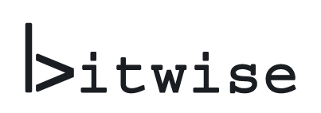

Written January 2021

[Link to the site](https://bitwise-a3c2d.web.app/)

[Link to the project github repo](https://github.com/mchartigan/bitwise/)



## Introduction

Purdue University's **CS 307 - Software Engineering** is an upper-level elective that satisfies requirements for majors and minors in the college of Computer Science. I decided to take this class in Fall 2020 as my last requirement of my CS minor, as I heard good things about it, and was excited to be able to create a functional application with a group of other students. As of Spring 2020, the class involved a proposal for the application or website the students wanted to design, where they would set their own goals and work towards them. However, over Summer 2020 this was changed to a more rigid set of requirements that did not leave much room for innovation. Although my team was dissapointed to learn this, we were releived to have many resources availible for the project assigned.

Our team consisted of five members:

- [Mark](https://mchartigan.github.io)
- [Zach G.](https://github.com/zgeorge22)
- [Zach M.](https://github.com/zmcclary1205)
- [Kyle](https://github.com/vandewak)
- and me!

The requirements, while many, boiled down to two simple words: *"make Twitter."* Short posts, images, timeline, liking, commenting, following users, tags, topics, etc. All social media sites nowadays follow this pattern, and we were assigned to add our platform to the mix. Our TA, Sid, suggested that we use Google Firebase as our platform, as they do the hosting and database management for users. This would come in handy, as our team had almost no experience in web development. We all had similar "I made a single page plaintext website in HTML in 2009" story, and I had done a little work with wrapped/unwrapped client APIs for Tumblr, Twitter, Discord, and Tenable.io. But this would be nowhere close to get us through developing an entire social media platform.

The project was broken up into three 3-week sprints, with a week between each one to write planning documents and retrospectives. These sprints are longer than the typical one-week professional sprints, but remember we are full-time students taking four other classes. The amount of time dedicated to the project over those three weeks was expected to be roughly 30 hours per person, equating a perfect 6-hour, 5-day workweek. 

The rest of this page will delve into the details and descisions made while building this site.

## Development

I know the history is all in github, but I want to write it out here so others can read it and get a little insight into our process. 

### Pre-Sprint 1

Firebase tutorials, javascript intro courses, doing basic things to learn the landscape. We had a fair amount of fear going into this project, but as we learned the basics that slowly dissolved.

If you are reading this page planning on making your own firebase project, MAKE YOUR FILES A REACT PROJECT FIRST, THEN ADD FIREBASE TO THE REACT PROJECT. This prevented us from making a full react app, and had to use CDNs for things we ideally would not have.

### Sprint 1

**Goals:** Basic UI, user accounts, posts, profiles.

I was very excited to get started on the site, and I was also the only member of the group who already had a Google Cloud Developer profile. I was able to make the Firebase project while sharing my screen with the team, because I didn't have to mess with connecting my bank account and stuff and it realy streamlined things. I was also able to get the first database calls out with the Firestore API, and pointed the group to the places I implemented them. 

Take a look at this section of code from the timeline page. I wrote this while referencing a tutorial that used list items to make a single page JS app. 

```js
// find the timeline by ID
const postList = document.querySelector('#timeline');

//...//

// create an HTML list element to store this post
let li = document.createElement('li');

// add children to this list element with post content
li.appendChild(topic);
li.appendChild(title);
li.appendChild(content);
li.appendChild(author);
li.appendChild(created);
if (doc.data().image != null) {
    li.appendChild(img);
}
li.appendChild(cross); // delete button

// add the post to the post list
postList.append(li);
```


This section of code worked. Querying the database, creating a HTML list, and adding it to the DOM works! This was a way to access the database, and then we could do other tests like modifying, adding, and removing data and then checking by reloading the homepage. We were working with what we knew, and that was barebones HTML. Its just very hard to do anything afterwards with this model, there was no room to grow. This was one representative piece that really shows the mood of what we had at the end of the first sprint. 


While I was starting to get the database working, Mark was hard at work on authentication, and Zach G and Kyle were getting their hands dirty learning how to style things and even a little bit of Semantic UI and React. 

By the end of the sprint, users were able to create an account, see their posts on their profile page, see other users posts in reverse chronological order, as well as make posts. Things were rough around the edges, but I think it would fall under "Minimum Viable Product" for a first sprint - and certainly much further than we thought we would get.

One of the bigger issues we had this sprint was redundancy while coding. The cause was when a team member pulled from Github, and then would go several days while working on a large change. Then, they would push that change, and would have reinvented the wheel to do something that was solved in the days since they last merged. This happened twice in this first sprint, and was a real wakeup call on how to work in a collaborative group project remotely like this. It was also perhaps a symptom of the large amount of work that has to be done in creating a webpage, which soon turns into modifying things that already exist when the site is extant. Either way, this problem did not come up again. 

### Sprint 2

**Goals:** 

got halfway done converting it to react elements.

my page redirection thing failed because i didnt understand how bitwise hosted things

### Sprint 3

Finished conversion into react-based project. New page redirection that was hacked together. 

Infinite scroll working perfectly, I was really proud of that one.

### Further work

I closed the api rules

## Reflections

take this from the document we already wrote

