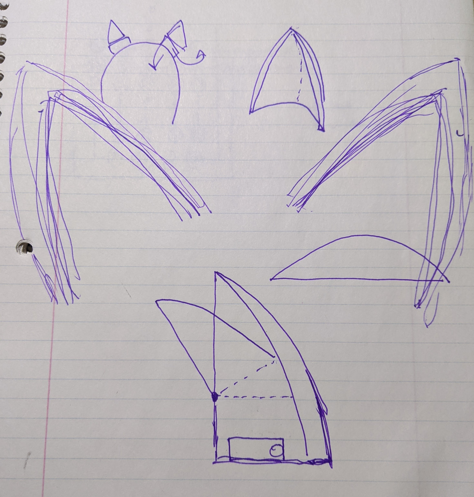
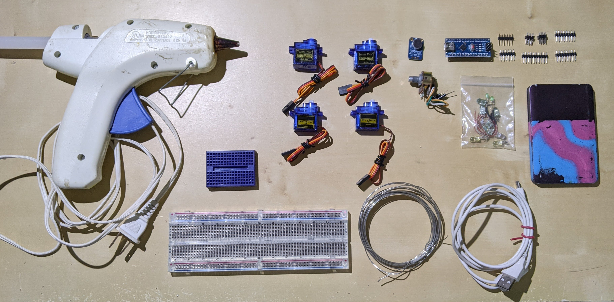
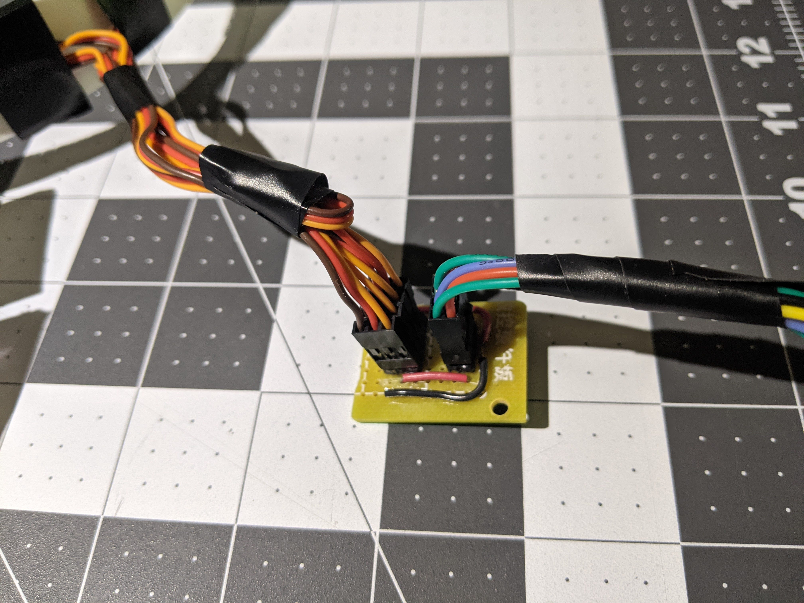
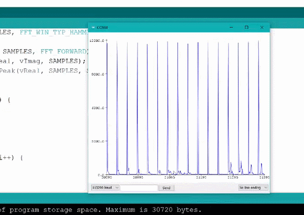

# Cat Ears Project

Written 12/29/2020

Nicky

## Goals

Simple streamable task. Make a set of wearable cat ears react to ambient music and sounds. 

## Hardware Design

The core of the motion design would be the four servo motors, two axes of motion for each ear. This would be enough to get the realism of cat ear motion with the 120 degree rotation. I worked out some layout basics in some sketches:

The main sensor input was planned to be the Adafruit microphone breakout board. This would get the music into the system without having to deal with an aux input or a bluetooth antenna. These would serve the purpose of being totally zero setup, so you could walk into any room with music playing and start reacting.

I had a lot of [Dollar Tree Foam Board](https://www.dollartree.com/readi-board-white-foam-boards/809955?sscid=a1k3_etby3) lying around, and wasn't really in the mood to CAD things for 3D printing. This would also allow me to start building without knowing exact dimensions, which is great for organic shapes like these. The sculpting process is simpler and got the job done, live on stream.

The rest of the parts were pretty standard, an arduino nano for contorl, and some cables and protoboard to distribute power and control, as well as a phone charger - a perfect source of regulated 5V power. The bundle of wires was a bit unruly, so I made a small distribution board and a harness to keep everything together.

## Program Design

So. I had been getting into [VVVV](https://vvvv.org/) at the time, and knew they had a Beat Detection plugin. How hard could it be? Well turns out beat detection is pretty hard, needs a good amount of memory, and fast processing power. I had neither the memory or the power on the nano, and I also kinda wanted to finish the project in a few days. This lead me to the section option that I came up with.

In a lot of dance songs, the drum pattern is pretty simple. A kick on beats one and three, and a snare on two and four. What is a kick drum but a wide spike across the low range of the frequency spectrum? I learned how to use the built-in arduino FFT functions, and started plotting the signals on the screen so I could determine some cutoffs.

The program model I used would wait for some frequency criteria to be fulfilled, and then trigger a response from the servos. This would be blocking, so the program would not care about the audio until the servo response was complete.

However. As I said earlier, beat detection is hard. Even on a dead-simple song like [Benny Benassi - *Satisfaction*](https://open.spotify.com/track/1n7omixiROWs5q6xpWiQuL?si=818d86d16b9446ee), finding the right bass spread took a lot of fiddling with the values. And the worst part is that changes by song (as producers mix the bass differently) and even depending on what speaker is being used to play the music.



## A New Idea

I decided to sleep on the solution to that one, and realized that maybe this was just too much for a simple program to solve. To get the project done in the next day or two, I wanted to get something to respond well. I had a [3-axis gyroscope](https://www.parallax.com/product/gyroscope-module-3-axis-l3g4200d/) lying around, and figured that would be a natural way to control the ears without resorting to buttons or a remote.

I set up some basic integration with the servos and the gyros, you hold the gyro in your left hand and the left ear approximates the motion. flipping your hand over (palm up) disables the ears and returns them to rest position, and when you return to the activated position, it resets the setpoint so integration error doesnt build up. That was a big problem early on, my integration was not happening very quickly because of the time it was taking to drive the four servos and the error was building up. This quick reset was very helpful.

## Power Issues

As soon as I moved away from bench power, I was immediately confronted with some issues. The whole system would shut down after a second or two of operation. Something about the power board on the 5V phone chargers was not letting them the high values of burst current, or shutting down when at idle levels. I don't know the exact reason, but it was the most annoying thing. 

Either way I got the footage and considered the project done. All the project software is located at [https://github.com/starmaid/catears](https://github.com/starmaid/catears)

