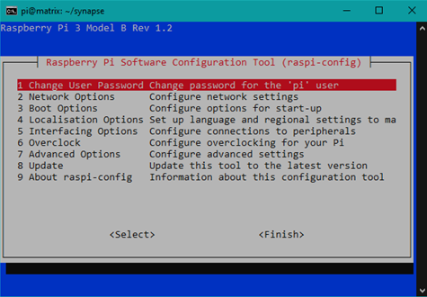

By Nicholas Masso

Written July 2020


Update August 2021: Added a comments section.

## Introduction

This guide will explain all the steps required to set up and run a matrix server, a federated (decentralized) and encrypted chat service. This will allow users with any compatible client to create accounts, join groups, and send messages. The most popular client is [Element](https://element.io/) which was previously known as Riot. While you and your friends can create accounts on your homeserver, the federated nature of matrix allows these accounts to join groups hosted on any server, around the world.

In a time when more and more of our communication is done through large, centralized corporations, it is important to take back control of your data. In this setup, all message logs and VoIP services will be managed by the Raspberry Pi in your home. 

Anyone trying to follow this guide should be familiar with working in the terminal on a Unix machine, as well as managing their local network. The steps performed in this tutorial could possibly open your home network to vulnerabilities if not performed correctly.

To fully complete every step will take roughly three hours, with large amounts of that time spent waiting for program installs and setup.  

### Requirements

To set up a server like this, you will need to have a domain name registered to redirect to your home IP address. You can attain these in various ways, and can set this up for free with a site like [freeDNS](https://freedns.afraid.org). 

You must also have administrator rights to your home network. This guide requires changing port forwarding rules, so you must be able to log into your home router.

The items needed are:
- A computer to run the setup on
- Raspberry Pi (Version 3B+ or newer)
- Optional: a case for the Raspberry Pi
- A power supply for the RPI capable of at least 2A
- A microSD card, with at least 8GB of space
- An ethernet cable

Your computer will also need to be able to resolve zero-configuration networking addresses.
- All computers running a Unix-based OS (including all Mac OS versions) can do this by default. No action is required.
- Computers running Windows must install a Zeroconf resolution service. Apple has a patent on [Bonjour](https://support.apple.com/kb/DL999) which you will have to download and install. 


 
## Steps

### Preparing the Raspberry Pi

1. [Download the latest version of Raspberry Pi OS Lite from the Raspberry Pi Foundation website](https://www.raspberrypi.org/downloads/raspberry-pi-os/)

    This installation includes the least amount of software required to run a full Debian-based OS on the Raspberry Pi. This will save us memory and disk space for this dedicated server. It does not have a graphical desktop environment, as we do not require one.

2. Flash the disk image to the SD card using your preferred disk imaging software. I use [Rufus](https://rufus.ie) for most of my disk creation.

3. Create an empty file called "ssh" and copy it to the boot directory of the SD card. This will enable SSH communication on the Raspberry Pi without connecting a keyboard. 

    

    **WARNING:** If you do not have a case for the Raspberry Pi, make sure it is not resting on a metal or otherwise conductive surface when you power it on. This could cause a short between the exposed pins of the Pi and destroy it. If necessary, put a nonconductive object underneath it.

4. Power on the Pi and connect it to your local network using ethernet or Wi-Fi.

5. Establish an SSH connection to the pi using your terminal of choice. 
    The default address is "raspberrypi.local"
    The default username is “pi”
    The default password is “raspberry”

    

6. Use the Raspberry Pi Software Configuration Tool to change defaults of the Pi. Running this command will open the graphical program to assist with changing some of the system details.

    ```
    $ sudo raspi-config
    ```

    

    a. Change the user password to something strong. Keep track of this password. A typical way to set strong passwords is [to use 3-4 short words.](https://xkcd.com/936/) This is easy to remember and hard to break.

    b. In “Network Settings” change the hostname to something recognizable like "matrix". 

    c. If you desire, in this tool you can also connect to a nearby Wi-Fi network.

7. Exit the utility and reboot the raspberry pi.

### Setting up the Network

8. Log into your router and assign the raspberry pi to an unused static IP address. Remember, we made the hostname "matrix" so it should be easy to identify from within the router’s settings.

9. Allow ports 80, 443, and 8448 to be forwarded to the Raspberry Pi. 

    Port 443 is dedicated to HTTPS encrypted data transfer and will be used by clients to receive and view messages. Port 8448 is the port used for server-to-server communications, so that users registered with other servers can get information about any groups hosted on our server. Port 80 will only be used to communicate with the certification servers, which will handle user authentication. This port will also refuse users who try to connect via HTTP protocol without encryption.

10. Log out of your router’s settings. Reboot the router if necessary.

11. Now we can SSH back into the Pi. We changed the hostname, so now you can either SSH to the new hostname (example, matrix.local) or directly to the static IP address you set.

12. Open the DHCPCD configuration file. We will be changing the Pi’s DHCP settings so that it knows it has a static IP address.

    ```
    $ sudo nano /etc/dhcpcd.conf
    ```

13. Scroll down and uncomment the "example static IP configuration" options as shown in the example below. Replace "192.168.0.199" with whatever IP address you set in the router configuration. You can leave the IPv6 address commented out, unless you are using it – in which case replace it with your value as well.

    ```
    # Example static IP configuration:
    interface eth0
    static ip_address=192.168.0.199/24
    #static ip6_address=fd51:42f8:caae:d92e::ff/64
    static routers=192.168.0.1
    static domain_name_servers=192.168.0.1
    ```

14. Reboot the pi again with this command.

    ```
    $ sudo reboot
    ```

### Install Prerequisites

Most commands we are going to run in this section of the guide will be done with the superuser authority.

15. Enter the superuser by running the command:

    ```
    $ sudo -s
    ```

    **WARNING:** be careful with all commands run while logged in as the root user. this user has the highest level of permissions on the computer and can seriously damage the operating system if not handled properly.

    The command prompt should change as shown below. This terminal session now has root authority.

    

16. Now we have to update all the software that came with the image for the pi. this may take a moment, as there may be several updates.

    ```
    # apt-get update
    # apt-get upgrade
    ```

17. Next we are going to install all software that is required by the matrix and synapse services.

    ```
    # apt-get install python3-pip python3-certbot-nginx libffi-dev sqlite3 libssl-dev libjpeg-dev libxslt1-dev libsodium-dev libopenjp2-7
    # pip3 install virtualenv
    ```

18. We are also going to set python 3 as our default python version using this command. 

    Note that at the time of writing, python 3.7 is the newest version. When a later version is released, make sure to update the path to the executable.

    ```
    # update-alternatives --install /usr/bin/python python /usr/bin/python3.7 1
    ```

19. Now we will leave the superuser by typing

    ```
    # exit
    ```

### Setting up Synapse Server
Now we get to start installing the programs which run the server itself.

20. We will create a python virtual environment in a new folder where we will keep all our files.

    ```
    $ mkdir ~/synapse
    $ virtualenv ~/synapse/env
    ```

21. Now we will enter the virtual environment with

    ```
    $ source ~/synapse/env/bin/activate
    ```

22. Inside the virtual environment, we must update and install some programs.

    ```
    $ pip3 install --upgrade pip virtualenv six packaging appdirs setuptools
    ```

23. Now we will install synapse in the virtual environment. This may take a while, but it will complete eventually.

    ```
    $ pip3 install matrix-synapse
    ```

24. Configure the server by running the following command with "example.com" replaced with your own domain name. 

    ```
    $ python -m synapse.app.homeserver \
        --server-name you.example.com \
        --config-path homeserver.yaml \
        --generate-config \
        --report-stats=yes
    ```

25. Next we will activate the certification program. This will trigger a series of prompts, which you can fill out.

    ```
    $ sudo certbot certonly --nginx -d you.example.com  
    ```

26. We will abide by good practice for matrix and configure a reverse proxy with Nginx. This will involve modifying a file and restarting Nginx

    ```
    $ sudo nano /etc/nginx/conf.d/matrix.conf
    ```

    Copy these contents into the empty file, with you.example.com replaced with your domain name.

    ```
    server {
        listen 80;
        listen [::]:80;
        server_name you.example.com;
        return 301 https://$host$request_uri;
    }

    server {
        listen 443 ssl;
        listen [::]:443 ssl;
        server_name matrix.example.com;

        ssl on;
        ssl_certificate /etc/letsencrypt/live/you.example.com/fullchain.pem;
        ssl_certificate_key /etc/letsencrypt/live/you.example.com/privkey.pem;

        location / {
            proxy_pass http://localhost:8008;
            proxy_set_header X-Forwarded-For $remote_addr;
        }
    }
    server {
        listen 8448 ssl default_server;
        listen [::]:8448 ssl default_server;
        server_name you.example.com;

        ssl on;
        ssl_certificate /etc/letsencrypt/live/you.example.com/fullchain.pem;
        ssl_certificate_key /etc/letsencrypt/live/you.example.com/privkey.pem;
        location / {
            proxy_pass http://localhost:8008;
            proxy_set_header X-Forwarded-For $remote_addr;
        }
    }
    ```

27. Save and close the file.

28. Restart the Nginx service to apply the changes.

    ```
    $ sudo systemctl restart nginx
    $ sudo systemctl enable nginx
    ```

    Next we will enable user registration on your server. We will still have to create an admin account manually, but this will allow friends to use your homeserver to store their accounts.

29. First we will open the server settings file

    ```
    $ nano ~/synapse/homeserver.yaml
    ```

30. Now we will find the line we want to uncomment by searching for `enable_registration` (ctrl+w). Find the correct line and uncomment it, and change `false` to `true`

    

31. Save and close the file once you are done.

### Registering a User

These steps will register the first user so that we can log into the server and manage it from a GUI client installed on our computer. 

32. These steps should be performed from inside the Python virtual environment, and in the synapse folder. Make sure the command prompt looks like this:

    ```
    (env) pi@matrix:~/synapse $
    ```

33. Start the synapse server with this command:

    ```
    $ synctl start
    ```

    Several messages will be printed to the screen. At the end, the program should say the program has been started.

    

34. Run the user configuration program with

    ```
    $ register_new_matrix_user -c homeserver.yaml http://localhost:8008
    ```

35. Follow the prompts to enter the username, password, and “yes” to make this user an admin.

    ```
    New user localpart [root]: [your username]
    Password: [hidden]
    Confirm password: [hidden]
    Make admin [no]: yes
    Sending registration request...
    Success.
    ```

36. You can now use a client to log into this server. Leave the python environment with 

    ```
    $ deactivate
    ```

37. And disconnect from the SSH session with 

    ```
    $ logout
    ```

**Note:** if you ever want to change settings for the server, stop the server first with

```
$ synctl stop
```

And then you can edit the homeserver.yaml file. Remember to start the server again with 

```
$ synctl start 
```

### Logging into the Server

Now that the server is running, you can download a messaging client to your computer, smartphone, or simply navigate to [https://riot.im/app/#/login](https://riot.im/app/#/login) with a web browser. 


When you are at the login screen, click “change” to specify your own homeserver to log into.


Enter your domain name here, and click next.


You should be able to enter the username and password you created in the earlier steps. You will be greeted by a homepage, were you can create and join communities.


## Conclusion

At the end of this document, you should have logged in to your server. You will have to create and manage rooms, which is a task specific to your client. You can send the URL of your server to your friends, and they can create user accounts in their own clients and message you! You can also join servers hosted by other people, and start talking in those groups. You can try joining the server at matrix.org, which is hosted by the Matrix Foundation itself. This is the largest public server, and you can talk to other people who are interested in freeware and privacy.

You also need to be mindful of the Raspberry Pi running the server. If you unplug the device, nobody who has an account on the server will be able to send messages – you could possibly invest in an uninterruptible power supply (UPS) to power your router and Raspberry Pi with, in the event your house loses power. Perhaps supply your email address to your members so that they can contact you if a problem arises.


*An Uninterruptible Power Supply could last without mains power for a long time!*

As the owner and administrator of your server, you need to be responsible for the things that go on inside your server. Perhaps create a set of rules for people who join, and make sure to remove people who spread hate or are not trustworthy. The security of your server’s content depends on the least trustworthy person who can read your messages! Most of all, have fun! You are now a pioneer of a new, safer form of communication.


 
*Make sure rooms you chat in have a notification like this.*
