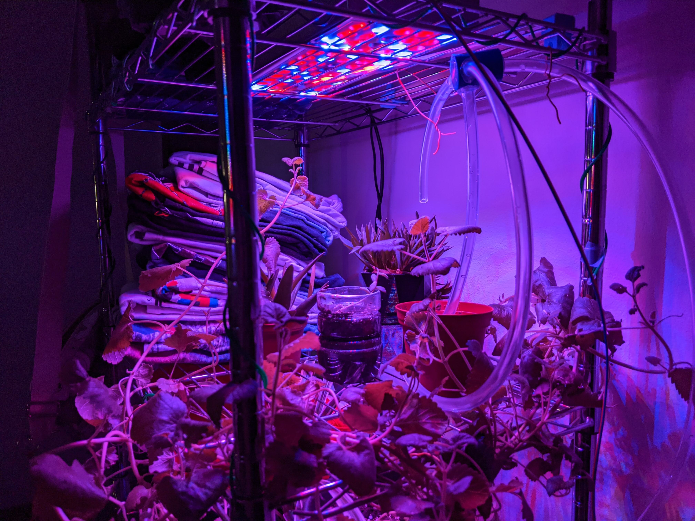
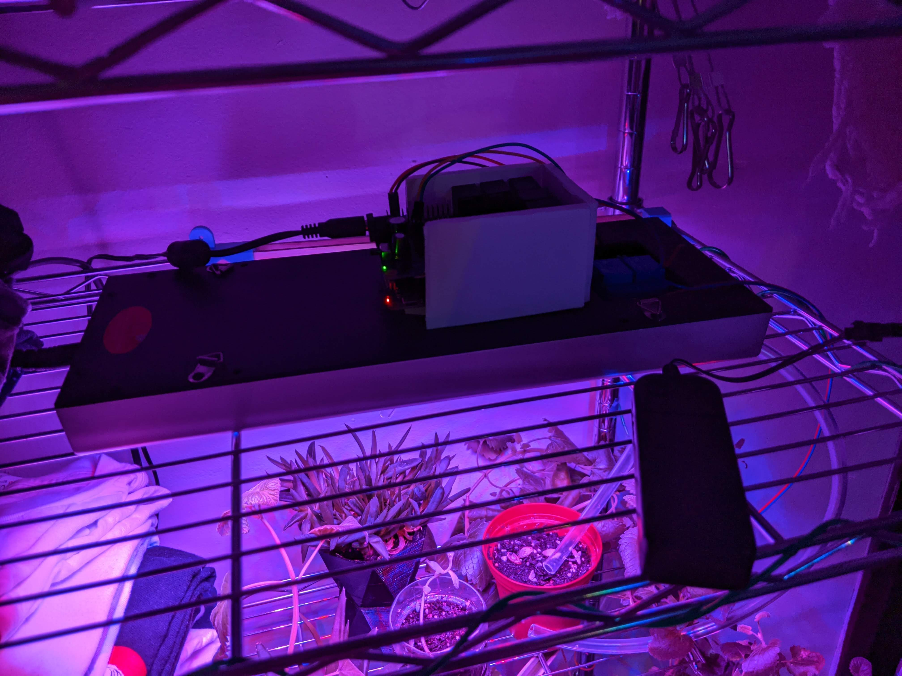

## Basic Commands

These are reference. If you want to use the RPI GPIO from the command line, these are the things you will need to do. I use simple 5v relays to control the pump (wired to 12V DC adapter) and the grow light (wired to AC wall power).

### Enable

```bash
# enable
echo XX > /sys/class/gpio/export
# be careful, this will send logical low to that port!!!
# if needed, send logical high immediately after
echo "out" > /sys/class/gpio/gpioXX/direction
```

### send high/low to GPIO pin XX

```bash
# low
echo "0" > /sys/class/gpio/gpioXX/value
# high
echo "1" > /sys/class/gpio/gpioXX/value
```

### Shutdown/release

```bash
# release
echo XX > /sys/class/gpio/unexport
```

## Scripts

I use these scripts to run the light and pump for my plants.



### Startup

```bash
#!/bin/bash

PUMP=23
LIGHT=24

echo $PUMP > /sys/class/gpio/export
echo $LIGHT > /sys/class/gpio/export

sleep 1s

echo "out" > /sys/class/gpio/gpio$PUMP/direction
echo "out" > /sys/class/gpio/gpio$LIGHT/direction

# set the light to on (high)
# and the pump to off (high)
echo "1" > /sys/class/gpio/gpio$PUMP/value
echo "1" > /sys/class/gpio/gpio$LIGHT/value
```

### Morning (9am?)

```bash
#!/bin/bash

PUMP=23
LIGHT=24

# turn on light
echo "1" > /sys/class/gpio/gpio$LIGHT/value

# wait a sec
sleep 5s

# turn on pump for like 2s
echo "0" > /sys/class/gpio/gpio$PUMP/value
sleep 3s
echo "1" > /sys/class/gpio/gpio$PUMP/value
```

### Night

```bash
#!/bin/bash

PUMP=23
LIGHT=24

# turn off light
echo "0" > /sys/class/gpio/gpio$LIGHT/value
```

