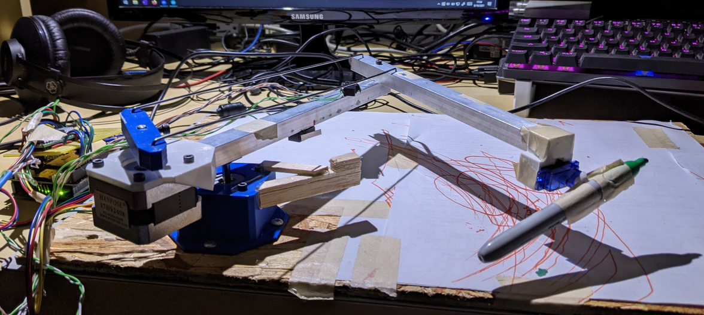
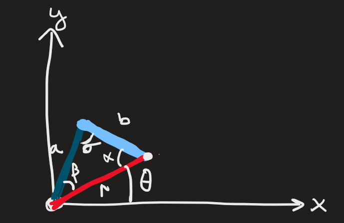
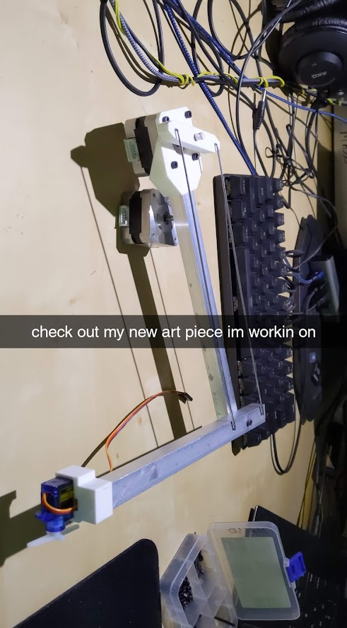
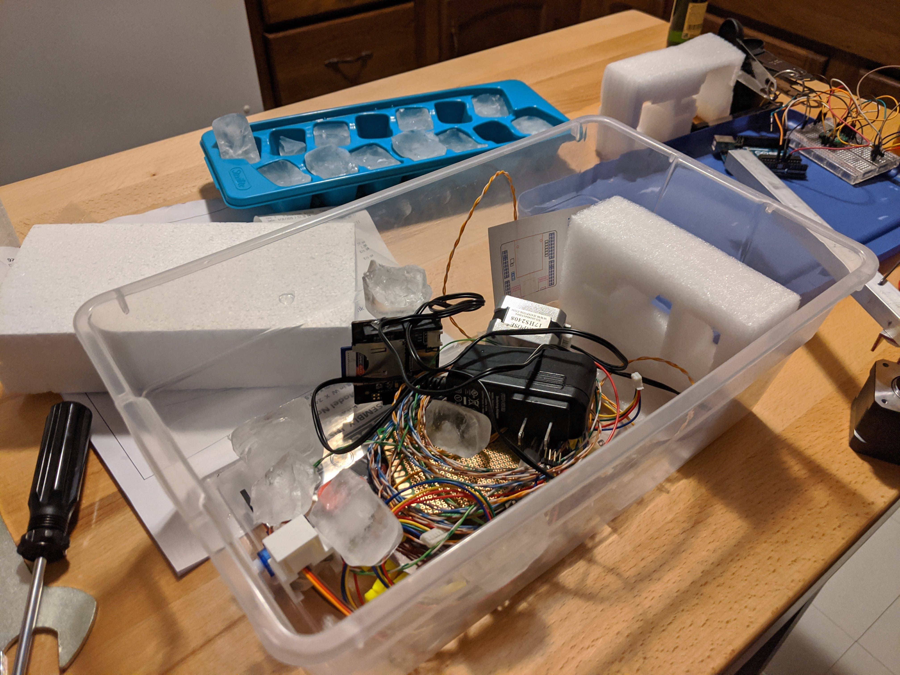
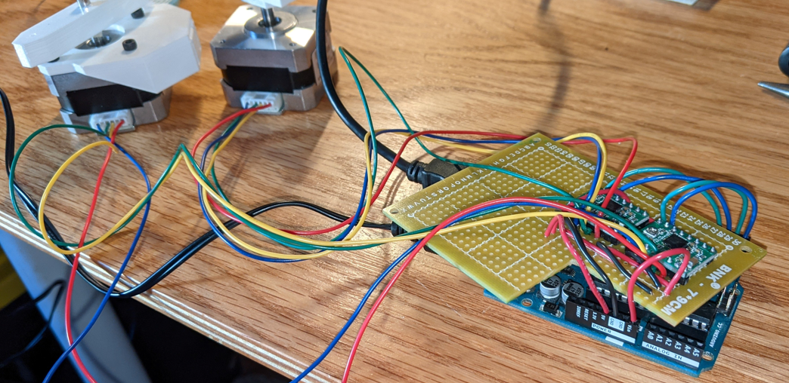

Written January 2022



## Introduction

When I arrived home for winter break after my first semester of university in 2017, my world had been turned on its side. I had finally recieved formal education for programming and robotics. Inadequate education had been my largest stumbling block thoguh high school, not even knowing what I didn't know. I hadn't been able to even ask the right questions, but that was all over. 

I don't remember what the inspiration was. I honestly think it might have just been the math high I got after finishing Calculus 3, which includes cylindrical and spherical 2nd order integrals - just taking the volume defined by a function defined in those coordinates. I was suddenly much more familiar with the trigonometric functions, and knew the forward kinematics of an arm like this would be possible for me to write.

At the core, here is the base concept. Its just a single triangle that you rotate around the origin.



## Version 1 (December 2017)

The initial concept was made in several hours of a late night on Monday, December 18th 2017. It was likely that a few days prior I started on the math and some rough code, but I didn't start building until that night. I only used supplies I had on-hand, servo motors that came in my arduino starter kit and some balsa rods.


Frist came testing the physical apparatus - setting the position of the servos to the values read from two potentiometers. You may recognize this as a slight variation of one of the servo example scripts.

```c
void loop() {
  val1 = analogRead(potpin1);            // reads the value of the potentiometer (value between 0 and 1023)
  val1 = map(val1, 0, 1023, 0, 180);     // scale it to use it with the servo (value between 0 and 180)
  val2 = analogRead(potpin2);            // reads the value of the potentiometer (value between 0 and 1023)
  val2 = map(val2, 0, 1023, 0, 180);
  myservo1.write(val1);
  myservo2.write(val2);                 // sets the servo position according to the scaled value
  delay(15);                           // waits for the servo to get there
}
```

Next was to get it controlled with commands from an input, I just took angle values in degrees over serial. Keep it simple.


After that, I needed to add a Z-axis. I placed the servo that controlled the pen angle to the pivot point, and routed a string around to a hinge made of tape and guided by paper. Lightweight and fast would be the solution here.


This raised the issue that would ultimately doom this project, but I naiively hoped I could leave it behind when i moved away from balsa. The torque at the end of the arm is rather high, and changes as the radius changes. I ended up adding a small post that dragged on the paper to keep the end at a consistent height.


By this point I was making sure that the calculations I were doing were correct, that I was getting a consistent radius and theta from the origin, even as the arm changed angles. The biggest problem here was related to the dragging post - approaching a point from above or below resulted in two separate ending positions, due to flex in the arm and slack in the servos (only accurate to one degree).

From here I just put a rectangular to polar conversion, and the code worked well enough to process X-Y pairs and plot lines between them.

```c
// rectangular to polar (radians)
rad = sqrt(yval*yval + xval*xval);
thet = asin( yval / rad ) * (180 / pi);

// convert radius to angles of the triangle
serv2 = acos((armA*armA + armB*armB - rad*rad) / ( 2 * armA * armB ));
thetAdjust = asin(( armA * sin(serv2) ) / rad );

// convert to degrees
thetAdjust = thetAdjust * (180 / pi);
serv2 = serv2 * (180 / pi);

// add the triangle to the base theta
thet = thet + thetAdjust + 10;
// adjust for the zero location of the second servo
serv2 = serv2 - 45;
```

From here, the next step would be better hardware. I put the project aside.

## Version 2 (June 2018)

I learned what stepper motor drivers are, redesigned the schematic in Fritzing (lost those files) and made an order from AliExpress. Ordering with the cheapest shipping had about a 40 day shipping time, and by the time they arrived I was busy with other things.

## Version 3 (December 2018)

I finally took the opportunity to write the next version of the software that utilized the stepper motors. I also now knew how to use functions in C, which I hadn't known in 2017. Heres a function to drive a stepper to a specific angle, while having a limit switch that can interrupt the movement if necessary.

```c
void stepper_angle(int motor, int deg) {
  // motor 1 or 2
  // dir = 1 for ccw, -1 for cw
  // deg = degrees
  int dir_pin;
  int step_pin;
  int lim_pin;
  int dir;
  int current_deg = 0;

  // Figure out what motor we are talking about
  if ( motor == 1 ) {
    dir_pin = s1_dir_pin;
    step_pin = s1_step_pin;
    lim_pin = lim1_pin;
  }
  else if ( motor == 2 ){
    dir_pin = s2_dir_pin;
    step_pin = s2_step_pin;
    lim_pin = lim2_pin;
  }
  else {
  }

  // Figure out what direction we are going
  if (deg > 0) {
    digitalWrite(dir_pin,HIGH);
  }
  else if (deg < 0) {
    digitalWrite(dir_pin,LOW);
    deg *= -1;
  }
  else {
  }

  // Move that far!!
  while (current_deg < deg) {
    digitalWrite(step_pin,HIGH);
    delayMicroseconds(stepper_delay);
    digitalWrite(step_pin,LOW);
    delayMicroseconds(stepper_delay);
    current_deg += deg_per_step;
    if ( digitalRead(lim_pin) == HIGH ) {
      break;
    }
    else {
      
    }
  }
}
```

I never actually got the stepper motors working, I wasn't pulling certain pins on the drivers high or low or something, and without getting the motors rotating at all I was pretty discouraged and put them back on the shelf.

## Version 4 (August 2020/March 2021)

On August 3rd, 2020, I was discouraged enough after crashing my drone into a lake that I decided to finally give another crack at the drawing arm I had been putting off. I don't think I was in the mood to do some programming, so I just opened solidworks, grabbed some scrap aluminum channel I had used for my original [lightbars project](http://starmaid.github.io/projects/hallie-lights) and finally built a robust mechanical version. The metal rods for the elbow are construction marking flags, burning through that pack of 100 I bought.



I also breadboarded and got the actual motors working, but I don't have any media of that. I just have this picture from Thursday August 27th at 1:27 in the morning, in the middle of an apartment party. I don't remember what was going on, but theres ice in the bin. No components were harmed.



The semester started, I forgot about the device. On Saturday March 13th, 2021, I pulled the falling-apart breadboard out of the bin and soldered everything onto a protoboard. 




i finished the mount and got everything running that weekend. the code i wrote so many years ago was working! now i needed to figure out how to control the speed....

switched from manually stepping the motors to using some stepper library. allowed me to control speed and run two concurrently. simplified the program a little bit.


